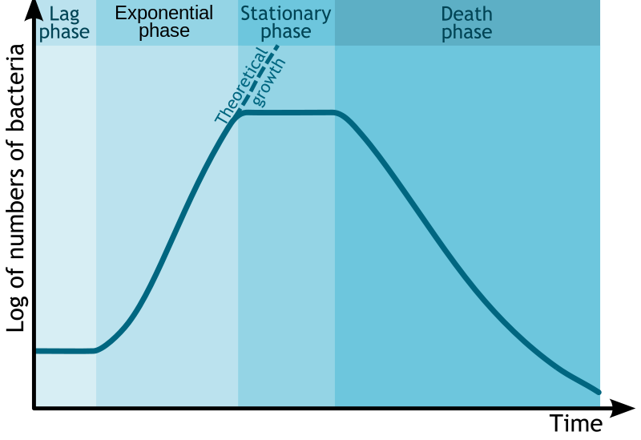

```{r setup, include=FALSE}
knitr::opts_chunk$set(echo = FALSE, message = FALSE, warning = FALSE)


library(learnr)
library(sortable)
library(learnrhash)
#library(interactiveBSE)
#source("../custom_learnr.R")
#source("custom_learnr.R")

##### Notes ####
```

## Introduction

In today's lab we will be quantifying cell growth and the sugar cells consume in order to grow. The ability to measure and control the status of cell cultures is a major function of biological engineers. Cells are essentially chemical reactors that catalyze numerous reactions to break down chemicals within the media, extracting energy, producing new chemicals and eventually producing more cells. By controlling cell growth and the chemicals cells produce we are able to produce antibiotics, insulin, and other human therapeautics. We can impact the environment by making organisms that remove pollution from our soil and water, capture carbon from our atmosphere, and produce enough food, fuel, materials, and chemicals to support our growing world population. There will be enormous challenges facing humanity in the coming years, and engineering biology will be critical to finding sustainable solutions.

As engineers we don't necessarily have to know the minutia of every chemical reaction in biological cells in order to extract useful value from them. In general we try to make use of the most abstract understanding biology in order to predict its bhavior and control it. At the most basic level we know that cells consume sugars to grow. How much sugar is required for a cell to divide into two? How fast can a cell consume this sugar and divide? These are critical questions for us as engineers to answer in order to predict and control how cells grow. 


To make 

## Remember Chemistry?

The stoichiometry of a chemical reaction tells us what chemical species are consumed and formed in a reaction and in what proportions. Stoichiometry is the basis of our ability to *quantify* chemical reactions.

Consider the chemical reaction:
$$
\ce{2 SO2 + O2 -> 2SO3}
$$


```{r balanced}
question_radio("Is this reaction equation balanced?", 
               answer("No"), 
               answer("Yes", correct = TRUE, message = random_praise()), 
               answer("I could use a refresher on balancing equations"), 
               message = "For a chemical reaction to be balanced, the number of atoms of each chemical species (S and O in this case) must be the same. A chemical reaction is just a rearrangement of those atoms between molecules. A nuclear reaction would create or destroy atoms.", 
               allow_retry = TRUE)
```

```{r cons-of-matter}
question_radio("Does it satisfy the law of conservation of matter?", 
               answer("Yes, a balanced equation satisfies the law of conservation of matter.", correct = TRUE), 
               answer("No, the equation is not balanced."), 
               answer("No, the equation does not satisfy the law of conservation of matter."), 
               random_answer_order = TRUE, 
               allow_retry = TRUE)
```


#### What does stoichiometry allow us to do?

Stoichiometry allows us to calculate the amount of one species from another.

To convert from the amount of one species to another we use the **Stoichiometric Ratio** — the ratio of the stoichiometric coefficients (in the balanced chemical equation) of two species participating in the same chemical reaction. 

Given the amount of one species consumed or produced, the stoichiometric ratio can be used to calculate the amount of any other reactant or product consumed or produced in that reaction.

$$
\ce{2 SO2 + O2 -> 2SO3}
$$

```{r stoich-ratio}
question_radio("If 1600 kg/h of SO<sub>3</sub> is produced, how much oxygen is required?", 
               answer(paste(signif(1600 / 80.6 * 1 / 2 * 16 , 2), "kg/h $\\ce{O2}$"), correct = TRUE, message = random_praise()),
               answer("320 kg/h $\\ce{O2}$"), 
               answer("80  kg/h $\\ce{O2}$"),
               allow_retry = TRUE)
```

## Accounting in Reactions

How do we keep track of how far reactions can proceed?

### Limiting Reactant

**Limiting Reactant** is present at less than its stoichiometric proportion compared to other reactants. All other reactants are **excess reactants**. 

```{r limiting-reactant}
question_radio("A reactor converting sulfur dioxide to sulfur trioxide, per the reaction $\\ce{2 SO2 + O2 -> 2SO3}$, is charged with 1400 kg of $\\ce{SO2}$ and 160 kg of oxygen. What is the limiting reactant?", 
               answer("$\\ce{SO2}$"), 
               answer("$\\ce{SO3}$"), 
               answer("$\\ce{O2}$", correct = TRUE), 
               answer("I could use a little more refresher."), 
               allow_retry = TRUE, 
               message = "To find the limiting reactant we need to convert each reactant mass to molar amounts. We can then compare these amounts to the stoichiometric coefficient for each of the reactants. The limiting reactant is has a the lowest ratio of molar amount to stoichiometric coefficient. This ratio is how many times the reaction can possibly happen.")
```


### Yields

Yields are often used to quantify the extent of chemical reactions. This is particularly true when there may be side reactions, series of reactions, or undefined reactions happening that deviate from the balanced chemical reaction we think is most likely to occur. In these cases the limiting reactant doesn't really make sense, since we aren't certain of all the reactions occuring. 

In biology, many chemical reactions are always happening so we use yields frequently to describe biological reactions.

There are a couple of different types of yields we use to describe the extent of chemical reactions. **Yield percents** and **yield coefficients** Yields are always ratios, but they differ on the basis, or denominator, of the ratio. 

### Yield Percent

**Yield percent** for a species (typically a product) is relative to a theoretical maximum amount of that species that could be formed. Yield percent is like an efficiency of the reaction. Yield percent is defined as
$$\text{Yield} = \frac{\text{actual moles of desired product formed}}{\text{theoretical maximum possible moles formed, based on reactant consumed}}$$
where the theoretical maximum assumes there were no side reactions and the limiting reactant has completely reacted (So purely based on the stoichiometry of the desired reaction). 

Note this can also be written in terms of mass since it is the same species, but stoichiometric ratios can only be applied to moles!

100% yield almost never happens!

Let's examine a typical example reaction from biology to demonstrate yields from biological reactions. 

For a given organism, substrate, temperature, pH, and other environmental conditions, we can describe cell growth by the following equation:

$$\ce{Cells + Substrate -> more \  Cells + Product}$$
One common biological reaction we use is the conversion of glucose to ethanol through yeast fermentation: 
$$\ce{C6H12O6 ->[yeast] 2C2H6O + 2CO2}$$ 

In this reaction the glucose ($\ce{C6H12O6}$) is the substrate the yeast consume to grow and make other molecules, and the ethanol ($\ce{C2H6O}$) is the product, or the molecule that yeast is producing that we care about. Within this biological reaction there are many other substrate and product molecules, but these are the ones that we care about in this case.

Returning to the question of yield from this reaction, some of the best ethanol yields from engineered yeast strains can be up to 90%. These engineered strains have mutations in their genomes that reduce the pathways leading to other products, however the cells need to do some other reactions in order to keep themselves alive.

#### Where did all the glucose go?

{max-width="100%" width="70%"}

It is actually quite surprising that we can even achieve 90% yield as cells need to also catalyze many reactions to produce and maintain the enzymes required to break down glucose into ethanol. Energy from glucose will also go into allowing cells to survive, grow, and divide/replicate.

### Yield Coefficients: Stoichiometry of cell growth

Cell growth and division is a very important reaction for biological engineers to be able to describe mathematically. In order to achieve 90% ethanol yield, cells need to be operating at maximum metabolic efficiency, which means we not only need to engineer the genomes of the cells, but we need to grow them properly to prepare them for success. Much of the work of biomanufacturing is in growing enough very healthy cells before giving the cells the signal to begin producing whatever their product is. This way most of the energy in the substrate goes into producing product instead of growing new cells.

So how do we measure and predict cell growth? Clearly with all of the possible metabolic pathways in a cell the stoichiometry can be very complex. As engineers we want to simplify things as much as possible, noting our assumptions, so that given those assumptions hold, we can engineer processes like cell growth. 

Returning to our general reaction describing cell growth by the following equation:

$$\ce{Cells + Substrate -> more \  Cells + Product}$$

But how could we possibly balance this equation?

To describe the stoichiometry of this reaction **yield coefficients** are typically used.

**Yield coefficients** are simply the quantity of one species in a reactor consumed or produced over the quantity of another species consumed or produced. So for a single chemical reaction with no side products, side reactions, etc, the yield coefficient boils down to just the ratio of stoichiometric coefficients. In this way yield coefficients are like stoichiometric coefficients. 

#### How do we define and calculate yield coefficients? 

We can use either mass or moles to define yield coefficients, so it is important to include units with molecular species.

We can define several different yields for any reaction or set of reactions.

Yield coefficient of cells on substrate: 
$$Y_{X/S} = \frac{\text{mass or moles of new cells formed}}{\text{mass or moles of substrate consumed}} = \frac{\Delta X}{\Delta S}$$

Yield coefficient of product on cells:
$$Y_{P/X} = \frac{\text{mass or moles of new product formed}}{\text{mass or moles of new cells formed}} =  \frac{\Delta P}{\Delta X}$$

Yield coefficient of product on substrate:
$$Y_{P/S} = \frac{\text{mass or moles of new product formed}}{\text{mass or moles of substrate consumed}} =  \frac{\Delta P}{\Delta S}$$

```{r conc-yields}
question_radio("If we are given substrate and product concentrations in the culture do we need to convert them to total mass or moles before calculating yields?", 
               answer("Yes!"), 
               answer("No!"), 
               answer("So long as the concentrations are in the same volume solution, that is, we can assume that the volume has not changes throughout the culture, then no. ", correct = TRUE),
               allow_retry = TRUE)
```


## Cell growth

Now that we have a sort of stoichiometry for cell growth with the yield coefficients, describing how much substrate is required to produce a new cell or a molecule of product, we need to think about how fast this process happens. What is the rate of cell growth? 

Cell growth unlike most chemical reactions, is an auto-catalytic process. Cells are required to produce more cells, and for every time point, the more cells you start with the more cells will be formed. How do we describe this?

Let's consider a batch reactor. This reactor is initially filled with some cells and substrate, it is then left to react/grow/ferment. The reaction can be described as:

$$\ce{Cells + Substrate -> More\  cells + Product}$$

What do you think cell growth looks like over time? 

Cell cultures go through a few distinct phases as they grow.

### Cell growth phases

Cells go through an initial lag in growth whenever they are introduced into a new culture that results from cells adapting to the media conditions. Once the cells are adapted they will enter exponential (or sometimes called logarithmic or log) growth phase, in which the cells double in number at some regular time interval. Exponential growth continues until the culture reaches its carrying capacity, when nutrients begin to become limiting or cell byproducts accumulate to high levels and inhibit cell growth. After some time the cells will likely start to die.

{max-width="100%" width="100%"}


### Modeling cell growth

To derive a mathematical model of cell growth in exponential phase, when cells are most-actively dividing and consuming substrate, we will use our mass balance on cells. Let's start with our general material balance. We are only going to considering the reactor once it is charged with cells, substrate, etc. and we are also ignoring the emptying of the reactor. 

In this scenario there is no flow in or out, cells are growing (being generated), but not being consumed (no cell death). So we only have a generation term that is equal to the accumulation of cells in the reactor. But what is that generation term? 

The generation, or growth rate of cells, is proportional to the amount of cells in the culture, as we described above. So, where X is the concentration of cells,
$$\text{gen} \propto x \\
\text{gen} = \mu_g X$$
and the proportionality coefficient $\mu_g$ is called the specific growth rate. 

$$
\begin{array}{cccccccccc}
  \text{General:} &\text{acc}& = & \text{in} & + & \text{gen} & - & \text{out} 
 & - & \text{cons} \\ 
 \text{Cells (X):}& \frac{dX}{dt} & = & 0 & + & \mu_g X & - & 0 & - & 0 
\end{array}
$$
**Assuming substrate is in excess and substrate is not limiting the growth rate!**
**Also, assuming no lag phase, see "Theoretical Growth in the diagram above.**

```{r limiting-substrate}
question_checkbox("What happens when substrate becomes limiting? (select multiple)", 
               answer("The reaction slows down", correct = TRUE), 
               answer("The culture enters stationary phase", correct = TRUE),
               answer("Nothing"), 
               answer("The cells die"),
               allow_retry = TRUE
               )
```


#### Solving this balance

$$\frac{dX}{dt} = \mu_g X$$
This differential equation can be solved by separation of variables:
$$\frac{dX}{X} = \mu_g dt$$
$$\int^X_{X_0}\frac{1}{X}dX = \int_0^t \mu_g dt$$
$$\ln\frac{X}{X_0} = \mu_gt$$
$$\frac{X}{X_0} = e^{\mu_gt}$$
$$X = X_0e^{\mu_gt}$$

#### What is $\mu_g$?

**Maximum specific growth rate**

Units: time^-1^ 

To calculate use linear regression to fit $\ln\frac{X}{X_0}$ (y) vs $t$ (x). 

**Make sure to only use the linear range!**

Use LINEST() in Excel/Sheets to easily adjust range.

Should there be a y-intercept? Lag phase can sometimes make it look like there should be a y-intercept. You should not force the intercept to be zero, because this will change your slope, and therefore your specific growth rate, but the intercept that is calculated isn't really meaningful. To factor in lag phase you really need a step function.

### What about modeling substrate and product?

We can use yields now to express the rates of product formation and substrate consumption in relation to cell growth.

$$\frac{dX}{dt} = \mu_gX$$
$$-\frac{dS}{dt} = \frac{1}{Y_{X/S}} \frac{dX}{dt} = \frac{1}{Y_{X/S}} \mu_gX$$ 

$$\frac{dP}{dt} =  {Y_{P/S}} \frac{dS}{dt}= \frac{Y_{P/S}}{Y_{X/S}} \mu_gX = Y_{P/X} \frac{dX}{dt} = Y_{P/X} \mu_g X$$ 


Note this assumes product is formed and substrate is consumed **only** during active cell growth, which isn't always true!

However in this lab, and in many cases, we are working with cells only when they are in active exponential growth. 

## Submit

```{r context="server"}
learnrhash::encoder_logic()
```

```{r encode, echo=FALSE}
learnrhash::encoder_ui(ui_before = default_ui(url = "https://canvas.vt.edu/courses/135076/quizzes/328972"))
```
