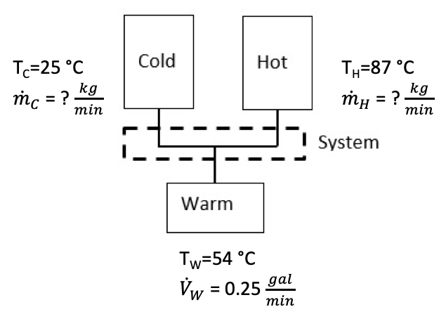

<script type="text/x-mathjax-config">
MathJax.Hub.Config({
  TeX: { 
      equationNumbers: { 
            autoNumber: "all",
            formatNumber: function (n) {return '9.'+n}
      } 
  }
});
</script>

```{r setup, include=FALSE}
knitr::opts_chunk$set(echo = FALSE, message = FALSE, warning = FALSE)


library(learnr)
library(sortable)
library(learnrhash)
#library(interactiveBSE)
#source("../custom_learnr.R")
source("custom_learnr.R")

### Notes ###
#
#
```


## Goal

The goal of this laboratory is to demonstrate the connection between the mass and energy balances of a system by designing a mixing system that will deliver an outlet stream of desired temperature and flow rate to a downstream process.

Specifically, after this lab, students will be able to do the following:

1.  Calculate the required flow rates of the hot and cold liquids that would result in a target temperature;

2.  Perform the laboratory exercise, acquire data from the experiment, and observe the conditions;

3.  Explain why there may be differences in calculated values versus the values obtained in the laboratory setting.

## Introduction

As biology is very sensitive to temperature changes, biological systems engineers are often faced with the challenge of trying to maintain a constant temperature of the systems we are trying to engineer, while simultaneously optimizing some other parameter. This difficult problem is often solved with temperature controllers that are essentially solving the material and energy balances describing a system at some regular time interval, in order to adjust heating or cooling mechanisms.

In environmental applications, biological systems engineers may be trying to determine how a higher temperature effluent ("waste" stream) is affecting the temperature of the stream, river, pond, or lake into which it is discharging. Many biota become stressed if the water temperature is too high for too long of a time. If temperatures are too high, the waterbody may be uninhabitable and biota may try to move elsewhere. Ensuring adequate temperatures of waterbodies is an important consideration for maintaining aquatic habitat for temperature-sensitive species.

In industrial applications, biological systems engineers must maintain the temperature of many different processes to ensure maximum quality and efficiency in production of foods, fuels, pharmaceuticals and chemicals. It is particularly critical that processes involving cells, such as beverage fermentation or protein production, or proteins, such as protein purification or enzymatic waste processing, because cells and proteins have a narrow range of temperature tolerances. 

In this lab, we will solve the mass and energy balances describing a mixing device that combines hot and cold water, each of specific temperature and adjustable flow rate, in order to achieve a specific flow rate and temperature of the resulting single effluent. This sort of problem has numerous applications. For example, wastewater from manufacturing or power plants cannot go above a certain temperature and flow rate when being discharged into the environment, or when formulating a protein therapeutic the temperature must be carefully controlled to retain the maximum activity of the therapeutic.

You have done mass balance problems now in your homework. This assignment requires a mass and energy balance. The first law of thermodynamics states that [energy cannot be created or destroyed.]{.ul} It can only change from one form to another, just as mass conservation laws state for mass. Let's consider two forms energy:

1.  Mechanical energy -- referred to as "work" and

2.  Thermal energy -- referred to as "heat"

The equations that govern the above energies are as follows:

1.  Mechanical energy: KE = ½mv^2^, 
    where m = mass, v = velocity

2.  Thermal energy: H = mC~P~ΔT, 
    where m = mass, C~P~ = specific heat, ΔT = change in temperature

The system that we're describing looks like this:

{max-width="100%" width="100%"}

Where we have hot and cold water entering the system and warm water leaving the system.

Once you learn that energy cannot be created or destroyed, just as mass cannot be created or destroyed, you understand the significance of a mass [and]{.ul} energy balance. For the problem you are solving, you must connect the mass and energy balances in order to balance the system.

## Apparatus

A simple apparatus combines two streams of flowing water at two different temperatures into a single stream. Valves control the flow of the entering streams so that the flow can be varied. Rotameters measure the volumetric flow rate of these streams. The apparatus consists of two large coffeepots, two rotameters, shut-off valve, and copper tubing.

## Procedure

Given the following information, calculate the flow rate in g/min to which the hot and cold water should be set to achieve the final temperature and flow rate. These given values are not certain and will definitely fluctuate depending on when you run your experiment, so make sure to solve symbolically so that you can easily plug in new values. It might also be beneficial to make a spreadsheet that will calculate flow rates for given temperature values.

Givens: T~0~ = 0°C, T~C~ = 25°C, T~H~ = 87°C, T~W~ = 54°C, ${\dot{m}}_{W}$ = 0.25 gpm

These given values are not certain and will definitely fluctuate depending on when you run your experiment, so make sure to solve symbolically so that you can easily plug in new values. It might also be beneficial to make a spreadsheet that will calculate flow rates for given temperature values.

```{r balances}
quiz(caption = "Developing balances ...",
     question_radio("What is the simplest form of our general balance equation for this problem?", answer("In - Out + Generation - Consumption = Accumulation"), 
                    answer("In - Out = Accumulation"), 
                    answer("In - Out = Generation"), 
                    answer("In = Out", correct = TRUE),
                    allow_retry = TRUE),
     question_radio("How would we write out the total mass balance for this problem?", 
                    answer("${\\dot{m}}_{C} + {\\dot{m}}_{H} = {\\dot{m}}_{W}$", 
                           correct = TRUE), 
                    answer("${\\dot{m}}_{C} - {\\dot{m}}_{H} = {\\dot{m}}_{W}$"),
                    answer("${\\dot{m}}_{C} = {\\dot{m}}_{H}$"),
                    answer("${\\dot{m}}_{W} - {\\dot{m}}_{H} = {\\dot{m}}_{C}$"),
                    allow_retry = TRUE))


```

```{r energy-balance}
question_rank("Put descriptions below the following terms describing the energy balance around our system into the following order  
              ${\\dot{m}}_{C} C_P T_C$  
              ${\\dot{m}}_{H} C_P T_H$  
              ${\\dot{m}}_{W} C_P T_W$", 
              answer(c("Heat energy of the cold water entering the system", 
                       "Heat energy of the hot water entering the system", 
                       "Heat energy of the mixed warm water exiting the system"), 
                     correct = TRUE),
              allow_retry = TRUE)
```

```{r dof}
question_numeric("How many degrees of freedom are there for this system of equations?", answer(0, correct = TRUE), post_message = "Right! 2 unknowns (${\\dot{m}}_{H}$ and ${\\dot{m}}_{C})$ and 2 equations (mass balance and energy balance).")
```


```{r predictions}
quiz(caption = "Given the above approximate values, what values of the hot and cold flow rates satisfy the mass and energy balances?", 
question_numeric("Hot flow rate (g/min)?", answer(440, correct = TRUE), 
                 try_again = random_encouragement(), 
                 post_message = random_praise(), 
                 allow_retry = TRUE), 
question_numeric("Cold flow rate (g/min)?", answer(500, correct = TRUE), 
                 try_again = random_encouragement(), 
                 post_message = random_praise(), 
                 allow_retry = TRUE)
)
```


Now that you have your predictive model

1.  Measure the hot and cold water using a thermometer. **NOTE: Be careful when opening the coffee pot as hot steam will come out.**

2.  Place a bucket underneath the output spout from the rotameters.

3.  Open the output spout so that water can pass through.

4.  Set the hot and cold rotameters to the values that you calculated in the pre-lab segment.

5.  Place a beaker into the stream of the mixed water and, at the same time, start the stopwatch. Either stop the stopwatch at a specified time or at a specified volume, whichever you prefer.

6.  Immediately measure the temperature of the mixed water.

7.  Convert the volume of mixed water collected to a mass by using the density equation ρ = m/V where ρ = density, m = mass, and V = volume. Use Table 1 below to find the appropriate density to use.

8.  Calculate the mass flow rate of the mixed water (i.e., warm water) given the amount of time used to collect the water.

*Conversions*

The specific volume of water is: v~f~ = 0.001 m^3^/kg OR ρ~f~ = 1/v~f~ = 1000 kg/m^3^

The specific heat of water is : C~P,H2O~ = 4.1868 kJ/(kg × &deg;C)

1 gal = 3785 cm^3^

**Table 1. Density of water in relation to temperature.**

  Temperature (°C)   Density (kg/m^3^)
  ------------------ -------------------
  0                  999.8
  4                  1000
  10                 999.7
  20                 998.2
  30                 995.7
  40                 992.2
  50                 988.1

## Data analysis

(Some of this is described above as well and is repeated here to make sure you include it in your report). 

1.  Calculate the flow rates of the hot and cold water needed to achieve a desired flow rate of 0.25 gal/min and temperature of 54°C for the mixed liquid.

2.  Convert the desired flow rate and your experimental, actual flow rate into mass flow rate rather than volumetric flow rate.

3.  Include both raw data and calculated results in your lab report. Follow the laboratory report guidelines in developing tables and/or graphs.

4.  Discuss within your group the best way to present your data and results. Present the data in a table/graph.

**[Discussion Questions (within your discussion section answer the following questions)]{.ul}**

1.  Provide a brief explanation of how mass and energy were conserved in this experiment.

2.  Do your calculated values and the experimental data make sense?

3.  Calculate the percent difference between your calculated values and the experimental demonstration values (temperature of hot, warm, and cold water, and flow rate of hot, cold, and warm water). Do your calculated values and experimental data differ? If so, provide plausible explanations for why they might differ.

4.  What are some errors or anomalies that could have been introduced in the experiment?

5.  Describe, using examples, how this lab is relevant to natural environmental systems (1 example) and manmade systems (1 example).

