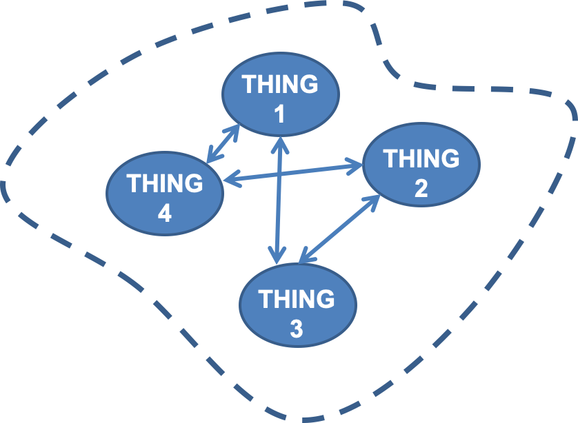
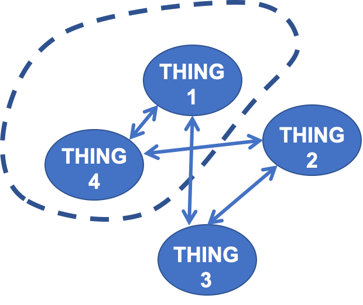

```{r setup, include=FALSE}
knitr::opts_chunk$set(echo = FALSE, message = FALSE, warning = FALSE)


library(learnr)
library(sortable)
library(learnrhash)
#library(interactiveBSE)
source("../custom_learnr.R")
#source("custom_learnr.R")

#### Notes ####
#
#
```

## Introduction

This module will introduce the basics of engineering balances. Just like forces (or momentum really) are balanced in physics to understand the forces and acceleration of systems using Newton's Third Law---for every force there is an equal and opposite force---we apply this and other **conservation laws** to solve almost every problem in engineering. By correctly applying these conservation laws and the balance equations that result from them, we can derive the governing equations for a system that predict the behavior of the system. 

At the end of this module you should be able to:  

- Given a description of a system, draw a diagram for the system labeled with given and other relevant information.  
- Choose a basis for the calculations you will be doing.  
- Write balances on the system as a whole, as well as relevant subunits of the system.  
- Perform a degree of freedom analysis to determine if you have enough information within your understanding of the system (givens, balances, and assumptions) to solve the problem.  
- Solve the system of equation that results from your balance equation and perform the resulting calculations.  

Once again, you will practice the skills we introduce here throughout the rest of this class and every class you take in biological systems engineering. It is always a good idea to revisit this regularly throughout your career. 

## Conservation Laws and System Balances

Just as Newton's Third Law defines that every force must be balanced by an equal and opposite force, we also know that mass and energy must be conserved, allowing their balance in space and time. The idea that matter and energy together cannot be be created or destroyed but instead converted from one form to another or transported from one system to another goes back to ancient philosophers in many different parts of the world. Antoine Lavoisier is most frequently credited with discovery of the "Law of Conservation of Mass" based on his quantitative experiments on the chemical conversion of mass during combustion. You may also have heard $E = mc^2$, energy is equal to mass times the speed of light squared. Albert Einstein's mass energy equivalence also demonstrates this conservation principle, but isn't very useful in typical biological systems, unless you are dealing with radioactive decay, or maybe deep space travel. So what equations are useful for balancing mass and energy in biological systems?

We can define a *general balance equation* for any arbitrary system, like the systems we talked about at the very first beginning of this class. We sometimes also refer to systems as processes, depending on what the system/process is, but they can almost always be used interchangeably.



A balance around a system like that above can be written on any conserved quantity within the system, such as mass (of the total system, or individual species), energy, force, or momentum. If the system as shown above is closed, there is nothing crossing the system boundaries, then we can write a simple balance equation.  
$$ \text{accumulation} = \text{generation} - \text{consumption}$$
So for the conserved quantity of our choosing, its accumulation within the boundaries of the system is equal to its generation minus its consumption within the system. You could think about this being a bioreactor or a wastewater pond in which some reaction is happening. There may be a few different separable phases or compartments, or different species of microbes, representing the Things. 

Because matter is conserved in chemical reactions---molecules can be consumed in the reaction(s) to generate new molecules but the atoms that comprise them can be neither created nor destroyed---we can write out a balance as above for each molecular species in the reaction, and this system of equations will satisfy the Law of Conservation of Mass. We start with a chemical reaction because biological systems are full of chemical reactions, but you could also think about balancing energy, forces, or momentum within a system in this way. 


This balance based on conservation principles is also flexible because the boundaries around our system are arbitrary, they don't necessarily need to be where they are drawn around all of the Things, we can draw them wherever is convenient for solving the problem at hand. For example, if we are most interested in what is going on in Thing 4 we could also draw a system, or a sub-system, around just Thing 1 and Thing 4. 



In this case we have streams from Thing 1 and Thing 4 entering and/or leaving the system boundary. So we need to expand our **general balance equation** to include this input and output from our system, yielding the universal form of the balance equation.
$$ \text{accumulation} = \text{input} + \text{generation} - \text{output} -\text{consumption}$$


This balance equation can be written out for any matter in our system, total mass, different types of matter, such as different chemicals, separable phases like sediment and water, or other entities like cells or people. It can also be written for other conserved quantities like energy, force or momentum. These are essentially the basis of thermodynamics (energy balances) and fluid dynamics (momentum balances). 

In writing a balance for a particular species, **input** is the amount of the species that enters the system from across the boundary, **generation** is the amount of the species produced within the system, **output** is the amount of the species exiting across the system boundary, **consumption** is the amount the species consumed within the system, and **accumulation** is the amount of the species that builds up in the system. 

Depending on which of these terms are included in our balances, and therefore what is going on in our system, we can define a few different types of systems or processes.  

- One of the biggest distinctions between types of systems is closed vs. open systems. We demonstrated these above. 
    - Our initial system was a **closed system**, there was nothing entering or exiting the system across the boundary, so the input and output terms could be excluded from our balance equation. 
    - The second system boundary we drew clearly had something crossing the system boundary, making this an **open system** so we needed to include the input and output.  
- We can also have systems that are changing over time, **transient** or **unsteady-state** systems, vs. systems that are not changing, **steady-state** systems. 
    - If a system is at a steady state it is not changing, meaning it is not accumulating anything. So the accumulation term in the general balance equation can be exclude, for steady-state systems.  
- Processes can also be categorized as batch, continuous, or semibatch.
    - **Batch** start have no input or output and are only concerned with the change in the species throughout the process. So batch processes take place in closed systems, generally, and are transient. 
    - **Continous** processes have *both* inputs and outputs. Continuous processes take place in open systems and may be steady-state but may also be transient if inputs and outputs are not equal or matched with generation and consumption.  
    - **Semi-batch** processes have either inputs or outputs but not both. Think about filling a reservoir with water or a reactor with media. Semi-batch processes take place in open systems and are transient.  

```{r match-systems}
question_rank("Match the order of the correct process classifications to the process descriptions.  
- An inlet stream 20 L/min is flowing into a 50,000 L holding pond, how long it will take to fill, assuming neglible out flow?  
- A reactor containing 20 L of media is innoculated with 10^10 viable cells. If the maximum specific growth rate is 0.1 h^-1, how long will it take for the culture to reach a concentration of 10^9 cells/mL?  
- To maintain humidity 1.5 mole% in an environmental chamber used for growing human cells, you install an evaporator unit in the air handling system. If the evaporator can evaporate 20 cm^3/min of water, what must the flow rate of air from the air handling system be to achieve 1.5 mole% water?  ", 
              answer(c("Semi-batch", "Batch", "Continuous"), correct = TRUE), 
                     allow_retry = TRUE)
```


Balances around systems/processes are the basis of most engineering. So how do we use them? Let's work an example to clarify.

### Writing Balance Equations: City example

Let's write a balance around a city to determine how the population is changing.

Every year 50,000. people move into a city, 75,000 people move out, 22,000 are born, and 19,000 die. 

To start we can write out our general balance, do you have it memorized yet?

$$ A = I + G - O - C$$
Now we need to fill in those terms with our given information, describe them with an appropriate variable, or cancel them out with an assumption.

```{r city-bal-1}
quiz(caption = "Quiz: What values correspond to the input, output, generation, and consumption terms for this system in ppl/yr?",
  question_numeric("Input?", answer(50000, correct = TRUE), allow_retry = TRUE), 
  question_numeric("Output?", answer(75000, correct = TRUE), allow_retry = TRUE),
  question_numeric("Generation?", answer(75000, correct = TRUE), allow_retry = TRUE),
  question_numeric("Consumption?", answer(75000, correct = TRUE), allow_retry = TRUE),
  question_text("Is this an open or closed system?", 
                answer("open", correct = TRUE), 
                answer("Open", correct = TRUE), allow_retry = TRUE),
  question_text("Is this a batch, continuous, or semi-batch process?",
                answer("continuous", correct = TRUE), 
                answer("Continuous", correct = TRUE), allow_retry = TRUE)
)
```


So now we can write out our balance and solve for the accumulation of people in this city. This makes accumulation here our variable of interest. 

```{r city-bal-2}
question_numeric("What is the rate of accumulation of people in this city?", 
                 answer((50000 + 22000 - 75000 - 19000), correct = TRUE), 
                 allow_retry = TRUE, 
                 try_again = "The answer is negative, double check your signs.", 
                 post_message = "$$
\\begin{array}{ccccc}
 \\text{accumulation}& = & \\text{input} & + & \\text{generation} & - & \\text{output} 
 & - & \\text{consumption} \\\\ 
 \\text{accumulation}& = & 50,000 \\frac{\\text{ ppl}}{\\text{ yr}} & + & 22,000 \\frac{\\text{ ppl}}{\\text{ yr}} & - & 75,000 \\frac{\\text{ ppl}}{\\text{ yr}}  
 & - & 19,000 \\frac{\\text{ ppl}}{\\text{ yr}} \\\\ 
 - 22,000  \\frac{\\text{ ppl}}{\\text{ yr}} & = &
\\end{array}
$$  
So based on the given rates the city's population will decrease by 22,000 people per year.")
```

This example brings up a great question: What time frame are we measuring and trying to predict/engineer? 

### Transient systems and process

With any transient system or process---whether it is a batch fermentation of sourdough, a pilot bioreactor producing a vaccine, or a semi-batch water treatment plant---the accumulation term of the balances are clearly non-zero, and are changing with time. Going back to calculus, we can divide balances on such system into two categories: 

- **Differential balances** - In differential balances the accumulation term is the derivative of the balance variable with respect to time. So for the concentration or mass of species A, $\frac{dC_A}{dt}$ or $\frac{dm_A}{dt}$. (Note that differential balances can still be steady state, in which case this derivative is zero). The other terms in the balance are also rates. Differential balances describe/predict the behavior of the system over time, as they are differential equations.
- **Integral balances** - In integral balances the accumulation term and other terms are amounts. So the accumulation in this case is the amount of the balance species that has accumulated between the two times of interest, simply $C_A$ or $m_A$. Integral balances describe/predict the state of a system at one time given some information at this time, and complete information at another time. 

So for some species or energy B, we can write differential and integral balances as follows, where $\dot{B}$ represents a rate and $B$ represents a quantity. 

$$
\begin{array}{cccccc}
  \text{General:} &\text{accumulation}& = & \text{input} & + & \text{generation} & - & \text{output} 
 & - & \text{consumption} \\ 
 \text{Differential:}& \frac{dB}{dt} & = & \dot{B}_{\text{in}} & + & \dot{B}_{\text{gen}} & - & \dot{B}_{\text{out}}  
 & - & \dot{B}_{\text{cons}} \\ 
  \text{Integral:}& \Delta B & = & B_{\text{in}} & + & B_{\text{gen}} & - & B_{\text{out}} & - & B_{\text{cons}} \\ 
\end{array}
$$

So in the above city example we have measured the given rates of people moving, dying, and being born, and we can find the rate accumulation of people at that point in time. This is a differential balance. If the problem was phrased as "In the past year 50,000 people moved into the city, ... How has the population changed in the past year?" this would be an integral balance. In this case we can just multiply our differential balance by the time period $\Delta t$ of 1 year to convert to the integral balance. 

In this class we are mostly concerned with either integral balances or steady-state differential balances. Remember from above, at steady-state the accumulation term is zero, so this removes the derivative term, making the differential equation of our differential balance an algebraic equation. Occasionally, we will also integrate differential balances to calculate time. For example, given a flow rate into a tank calculate how long it will take to fill. 

In future classes you will deal with true differential balances that allow you to derive expressions to predict the velocity and forces within moving fluids or the amount of time required for a culture of cells to reach a certain population size. 

### Some general rules for simplifying balances

Going back to the algorithm for engineering calculations laid out in the previous lab we can expand a bit on steps 1 and 2 now that we have discussed deriving material balances.

1. Draw a diagram of the system of interest and label the diagram with everything you know about the problem. What quantities are given? What quantities are unknown? What units are given and asked for?  
    + Fully label every input and output stream with known variables.  
    + Label unknown variables with appropriate symbols. These can vary, but typically $m$ for mass, $n$ for moles, $V$ for volume, and the dotted versions for respective flow rates. For mixtures of liquids $x_A$ is used to represent the mass or mole fraction of component $A$, for mixtures of gases $y_A$ is used. 
    + Minimize unknown variables. Are there any unknowns that you can define in terms of other unknowns. For example, if you have a 3 component mixture, you only need to define 2 as unknowns, because the third component will be remainder of that mixture. 
    + Simplify future calculations by looking over your flow diagram and deciding what units are are going to be most convenient for doing the calculations. This is called the **basis** of calculation. What final units do you need? What units are most given quantities in? Convert any quantities with odd units to the basis.
2. Derive the equations describing the system. These will typically be derived from material and energy balances.
    + Begin with the general, differential or integral balance equation. Simplify this balance based on the type of system you are dealing with. Is there a reaction happening? Is the system steady state?
    + Figure out how many balances you can possibly write. How many subunits does your process have? How many different species are in your process? We can write a balance for each subunit and species as well as an energy balance. However, all of these equations are not independent (more on this when we expand on degrees of freedom). 
    + Reserve a few lines of space to write out each of these balances. 
    + Fill in below the general terms of your general balance (In, Out, etc) with the specific variables or quantities that make up that term from your flow diagram.
    + Simplify these balances individually as much as possible.

Let's put these steps into practice!

## Mass Balance Example 1 

This is an example that you could probably solve easily without following the engineering calculation algorithm, but to introduce some of the concepts within it in a simple way let's walk through its steps with this relatively simple example.

You have an overabundance of cucumbers in your garden and have decided to make a batch of naturally fermented pickles, to prevent them from going to waste. You've read up on this and found you need 3% by weight salt in the finished pickles to promote the growth of good, souring, lactic acid bacteria, while preventing the growth of spoilage organisms. 

You have 2.00 kg of cucumbers that you have sliced and salted with 100. g of salt to draw out some of the liquid and make sure they stay crunchy after they are pickled. After about 1 hour you take these salted cucumbers and their juice and add them to your pickling crock along with 200. g (combined) of garlic, dill, and spices, and enough water to cover the pickles, an additional 1.50 L of water. How much salt do you need to add to this mixture to reach 3.00% salt in the total pickle mixture (including the weight of everything, spices, salt, and all)?

Starting from the top of the engineering calculation algorithm:

### Flow Diagram  

1. Draw a diagram of the system of interest and label the diagram with everything you know about the problem.
    + Fully label every input and output stream with known variables.
    + Label unknown variables with appropriate symbols. 
    + Minimize unknown variables. Are there any unknowns that you can define in terms of other unknowns. For example, if you have a 3 component mixture, you only need to define 2 as unknowns, because the third component will be remainder of that mixture. 
    + Simplify future calculations by looking over your flow diagram and deciding what units are are going to be most convenient for doing the calculations. This is called the **basis** of calculation. What final units do you need? What units are most given quantities in? Convert any quantities with odd units to the basis.
    
```{r diagram-quiz}
quiz(caption = "Answer the following to help you draw your flow diagram.",
  question_checkbox("Which of the following are inputs?", 
                    answer("Salted cucumbers and liquid", correct = TRUE), 
                    answer("Water to cover", correct = TRUE), 
                    answer("Garlic, dill, and spices", correct = TRUE), 
                    answer("Extra salt", correct = TRUE), 
                    answer("Final pickle mixture"), allow_retry = TRUE, 
                    random_answer_order = TRUE),
  question_checkbox("Which of the following are outputs?", 
                    answer("Salted cucumbers and liquid"), 
                    answer("Water to cover"), 
                    answer("Garlic, dill, and spices"), 
                    answer("Extra salt"), 
                    answer("Final pickle mixture", correct = TRUE), 
                    allow_retry = TRUE, 
                    random_answer_order = TRUE),
  question_checkbox("What quantities are unknown?", 
                    answer("Mass of salted cucumbers and liquid"), 
                    answer("Mass of water to cover"), 
                    answer("Mass of garlic, dill, and spices"), 
                    answer("Mass of extra salt", correct = TRUE), 
                    answer("Mass of final pickle mixture", correct = TRUE), 
                    answer("Percent salt in the final pickle mixture"),
                    allow_retry = TRUE, 
                    random_answer_order = TRUE), 
  question_checkbox("What units would you use as your basis of calculation?", 
                    answer("Liters"), 
                    answer("Grams or kilograms", correct = TRUE), 
                    answer("Moles"), 
                    answer("Cucumbers"), 
                    allow_retry = TRUE, 
                    random_answer_order = TRUE, 
                    post_message = paste(random_praise(), 'Here is our diagram.
                    '))
)

```

    
2. Derive the equations describing the system. These will typically be derived from material and energy balances.
    + Begin with the general, differential or integral balance equation. Simplify this balance based on the type of system you are dealing with. Is there a reaction happening? Is the system steady state?
    + Figure out how many balances you can possibly write. How many subunits does your process have? How many different species are in your process? We can write a balance for each subunit and species as well as a total mass balance and a total energy balance. However, all of these equations are not independent (more on this when we expand on degrees of freedom).
    + Reserve a few lines of space to write out each of these balances, making a table like below for the form of the general balance for your system:
    $$
    \begin{array}{cccccc}
      \text{General:} &\text{accumulation}& = & \text{input} & + & \text{generation} & - & \text{output} 
     & - & \text{consumption} \\ 
     \text{Species A:}& &&&&&&&& \\
      \text{Species B:}& &&&&&&&& \\ 
    \end{array}
    $$
    + Fill in below the general terms of your general balance (In, Out, etc) with the specific variables or quantities that make up that term from your flow diagram.  
    + Simplify these balances individually as much as possible.
    
```{r balances-quiz}
quiz(
  question_checkbox("What type of system/process is this problem?", 
                    answer("steady-state", TRUE), 
                    answer("transient"), 
                    answer("continuous"), 
                    answer("semi-batch"), 
                    answer("batch", TRUE),
                    answer("open"), 
                    answer("closed", TRUE),
                    allow_retry = TRUE, 
                    random_answer_order = TRUE),
  question_radio("What form is your general balance going to take?", 
               answer("Input = Output", correct = TRUE),
               answer("Accumulation = Input - Output"),
               answer("Accumulation = Input + Generation - Output"),
               answer("Input + Generation = Output"),
               answer("Accumulation = Input + Generation - Output - Consumption"),
               allow_retry = TRUE,
               random_answer_order = TRUE, 
               post_message = "Yes, now we can write out the balance for each species!")
)
```

### Balances

We can now fill in each of the input and output balance terms for each species in our table. However, several species in this system don't matter, they just make up total mass. Actually all that we really care about is salt and total mass, right? All of the other balances don't have any unknowns in them that we care about (for example we don't care about the mass percent of cucumbers in the finished pickles). So let's just write the total mass balance and the salt mass balance. 

To write these balances we simply go through the inlet streams and identify the terms describing the mass of the species we are writing our balance for in that stream. In the case of the total mass balance this means we add the mass of all of the species going in. For the salt balance, we only have salt in the salted cucumbers ($m_{1S}$) and the extra salt we are adding after we've added everything else ($m_{3S}$). Then we write an equal sign and we do the same for the outlet/finished product. We don't know the total mass of the final pickle mixture, so we this is just $m_4$ for the total balance. The mass of salt in the final product is this total mass $m_4$ times the percent salt in the final product, which we have decided should be 3%, or symbolically, $x_{4S}$.

Here are our finished balances:


### Degrees of Freedom

3. Double check that you have enough information to solve the problem with a degree of freedom analysis.
    + Determine the number of unknowns.
    + Determine the number of equations describing the system. For a non-reactive process, a balance can be written for each species in the system. Check that these equations are independent.
    + DoF = unknowns - equations
    + Are the degrees of freedom zero or negative? If the degrees of freedom are positive, restart the algorithm.
    
Let's go into a little more background on what degrees of freedom means. 
    
    
## Degrees of Freedom

We have a system of equations resulting from our material balances, containing some known and some unknown variables. Calculating the degrees of freedom of this system is simply an accounting exercise balancing the number of equations with the number of unknown variables. This let's us know how many possible solutions there are to this system. 

As a simple example of degrees of freedom we can think about the equation for a line. 
$$y = mx + b$$
If we know the values of $m$ and $b$, we are left with 2 unknowns $x$ and $y$, which define a straight line. Since we only have this one equation our degrees of freedom analysis is 
$$
\begin{array}{rl}
    & 2 \text{ unknowns } (x \text{ and } y) \\
  - & 1 \text{ equation}  \\ \hline
    & 1 \text{ degree of freedom}
\end{array}
$$
This one degree of freedom defines a line, we can plug in any value of $x$ and calculate a $y$, or *vice versa*. 

If our analysis results in zero degrees of freedom then we have a single value for our unknowns that results in a "balanced" equation. Balancing is often used to describe solving a system for all unknowns. For example if our system resulted in two equations 
$y = m_1x + b_1$ and $y = m_2x + b_2$ and $m_2$ and $b_2$ are both known and the equations are independent then our degree of freedom analysis would result in 0 degrees of freedom. If we can simplify one more equations in our system to another, then they are not independent, *e.g.* if $m_1$ and $b_1$ can be multiplied by some single number to equal $m_2$ and $b_2$.

So in this case the degree of freedom analysis yields:
$$
\begin{array}{rl}
    & 2 \text{ unknowns } (x \text{ and } y) \\
  - & 2 \text{ equations}  \\ \hline
    & 0 \text{ degree of freedom}
\end{array}
$$
Zero degrees of freedom means that we have one value for each unknown that satisfies this system of equations. Visually, there is one intersecting point between these two lines. All other point along these lines satisfy only one equation. 

```{r dof-matching}
quiz(caption = "Quiz: How many degrees of freedom does each of the following systems of equations have?", 
  question_numeric("$y = 2x + 3 \\\\
12 = 4y - 8x$", answer(1, correct = TRUE, message = "the equations are not independent")),
  question_numeric("$n_1 = n_2 + 45 \\\\
0.5n_1 = 0.5n_2 + 10$", answer(0, correct = TRUE)),
  question_numeric("$42x_1 + 36x_2 = 0.1n_3$", answer(2, correct = TRUE))
)
```

If the number of degrees of freedom is zero the problem can be solved as currently laid out. 

If the degrees of freedom are positive, the system is **underspecified** additional information must be made available to solve. Is there a balance missing, or some other relationship between variables available? Can you make an assumption to simplify the problem? Don't forget energy balances, process specification, relationships between physical properties (like density, ideal gas laws), stoichiometry, or stream balances (the sum of component fractions in one stream must be 1). It the degrees of freedom are 1 or 2 you can possibly visualize the relationship between unknown variables and find some optimum.

If the degrees of freedom are negative the system is **overspecified**. Make sure you are not missing any unknowns, and your equations are independent. If everything checks out, proceed to solve the system and you can use the extra information to double check your solution. 

## Back to making pickles 

### Degree of Freedom

We know from our balances that we have 2 unknowns and 2 equations, and so we have 0 degrees of freedom, our system can be solved for one unique value to each unknown. In the balances below, both contain unknowns $m_{3S}$ and $m_4$.


What would happen if we wrote out the other balances? Well we would need to add an unknown for each new species balance, the mass fraction of that species in the final pickle mixture. So adding 1 new balance and 1 unknown will keep our system balanced allowing us to calculate these fractions, which might be useful, for example, if we wanted to make a final ingredients list sorted by the amount of each ingredient, like you would find in the nutrition facts label.

### Strategy

4. Plan a strategy for solving the problem. Is it a simple single balance that must be solved? How many unknowns are in each equation? Do you need to simultaneously solve a system of equations? If there are differential equations, is there an analytical solution to the equations?

```{r strategy}
quiz(caption = "Let's think through our strategy:",
question_radio("How many unknowns are in each balance?", 
               answer("Total: 2, Salt: 2", TRUE),
               answer("Total: 1, Salt: 2"), 
               answer("Total: 5, Salt: 2"), 
               answer("Total: 1, Salt: 1"),
               allow_retry = TRUE,
               random_answer_order = TRUE),
question_text_block("How would you solve this system of equations?", 
                    message = 'You could either solve one equation for one unknown and plug this into the other or plot both equations and find the intersection of the two lines. Since we are asked for the mass of extra salt to add, $m_{3S}$, and since the total balance is already solved for $m_4$, it is easiest to plug $m_4$ from the total balance into the salt balance.',
    answer("", correct = TRUE),
    allow_retry = TRUE,
    correct = paste(learnr::random_praise(), 
                    "Here's our answer:"),
    try_again = "Here's our answer:"
)
)
```

### Solve

5. Solve the equations **symbolically** for the desired quantity, if possible or use equation solving software. Generally, this will prevent errors in your calculations by simplifying them (canceling single symbols is easier than canceling compound units). This will also prevent rounding errors from propagating from one calculation to another. Only determine sig figs for each answer after calculation, and do not use the rounded answer to calculate other answers!

Additionally, when you are on the job, you might not be asked to calculate only one value for one set on unknowns; you are much more likely to need to define the relationship between some unknowns. Like the example above, maybe we plan to commercialize our pickle recipe and we do need to determine the mass fraction of each species in the final product. Or we may want to generalize our recipe since the shape and density of cucumbers will vary, requiring different amounts of water to cover and different amounts of added salt to reach 3% of the final total mass. 

```{r solve1}
question_radio("Which of the following is a correct equation for calculating the mass of extra salt to add, based on the above flow diagram?", 
               answer("$m_{3S} = \\dfrac{(m_{1C} + m_{1S} + m_{2F} + m_{2W})x_{4s} + m_{1S}}{1-x_{4S}}$", TRUE),
               answer("$m_{3S} = \\dfrac{(m_{1C} + m_{2F} + m_{2W})x_{4s} + m_{1S}}{1-x_{4S}}$"),
               answer("$m_{3S} = \\dfrac{(m_{1C} + m_{1S} + m_{2F} + m_{2W} + m_{3S})x_{4s} + m_{1S}}{1-x_{4S}}$"),
               answer("$m_{3S} = \\dfrac{(m_{1C} + m_{1S} + m_{2F} + m_{2W})x_{4s} + m_{1S}}{x_{4S}}$"), 
               allow_retry = TRUE, 
               random_answer_order = TRUE, 
               post_message = paste(random_praise(), 'Here is how we reached this solution:  
               ')
)
```

### Calculate

6. Write a dimensional equation for your solution, plugging in values and units of given quantities, and apply any necessary conversion factors to calculate the desired quantity in the desired units.

```{r salt-mass}
question_radio("How much salt do you need to add to the mixture to reach 3.00% by mass salt in the final product?", 
               answer("221 g", message = "Double check that you didn't forget to add something"), 
               answer("220 g", message = "Double check your rounding"),
               answer("118 g", message = "Double check that you didn't forget to add something"),
               answer("117.7 g", message = "Double check that you didn't forget to add something and your sig figs"),
               answer("14.4 g", correct = TRUE),
               answer("14.43 g", message = "Double check your sig figs"),
               allow_retry = TRUE, 
               random_answer_order = TRUE, 
               post_message = paste(random_praise(), 'Here is how we reached this solution:  
               '))
```

### Check

7. Double check that your answer is feasible. How do you know your answer is right? You can plug your answer back into your balance equation and calculate a known quantity, estimate the "order of magnitude" of your answer, and/or just ask yourself "does this number make physical sense"?

```{r double-check1}
question_text_block("How could you double check your answer?", 
                    message = 'You could get an estimate of whether your final salt concentration is close to 3% by just adding up all of the salt components and dividing by all of the other components. 
                      
                    You could also plug in your number for $m_{3S}$ and calculate the fraction of salt in the final product from that, but if you have an error in your equations you might not catch this. There are many possible ways to check. If you take the time to double check you will likely catch any errors that have occured.',
    answer("", correct = TRUE),
    allow_retry = TRUE,
    correct = paste(learnr::random_praise(), 
                    "Here's our answer:"),
    try_again = "Here's our answer:"
)
```


## Submit

At this point you can submit your work.

```{r context="server"}
learnrhash::encoder_logic()
```

```{r encode, echo=FALSE}
learnrhash::encoder_ui(ui_before = default_ui(url = "https://canvas.vt.edu/courses/135076/quizzes/311123"))
```

We will work on the following example in class, but feel free to read through ahead of time so that you can have questions ready. 

## Mass Balance Example 2

Let's go back to the evaporator example from above. First a little background and motivation for evaporators. 

To grow human cells *in vitro* (latin for in glass, meaning any science done in the lab in a glass or plastic vessel, outside of the native environment) you need to maintain high humidity and CO~2~ concentrations. The CO~2~ seems odd, but it is critical for maintaining the proper pH of the basic bicarbonate-buffered culture media. The CO~2~ dissolves into the media, becoming carbonic acid that can then donate or accept hydrogen ions, maintaining the pH.  This bicarbonate buffer is the same way your body maintains its pH. Because your cells are constantly producing CO~2~ from metabolism, your body has around 5% dissolved CO~2~. If your blood is becoming acidic you may hyperventilate to expel excess CO~2~ and return to normal pH. Because the ocean isn't buffered like our blood is, this is also how ocean acidification is caused by anthropogenic increases in atmospheric CO~2~. 

So returning to the problem we want to install an evaporator unit which will evaporate liquid water into dry air to maintain humidity and also inject pure CO~2~ to maintain the buffer of a big cell culture environment, perhaps producing protein therapeutics, like antibodies, or vaccines. 

If the evaporator can evaporate 20. cm^3^/min of water, what must the flow rate of dry air (0% H~2~O) from the air handling system be to achieve 1.5 mole% water in the outlet? At what rate must pure CO~2~ be delivered in order to achieve 5.0 mole% CO~2~?

Let's put our calculation algorithm to use, and solve this!

1. Draw a diagram of the system of interest and label the diagram with everything you know about the problem.
      + Fully label every input and output stream with known variables.

```{r flow-diagram}
quiz(question_numeric("How many input streams are there to the evaporator?", 
                      answer(3, correct = TRUE), 
                      allow_retry = TRUE), 
     question_checkbox("What are these input streams?",
                       answer("Dry air", correct = TRUE),
                       answer("Water", correct = TRUE),
                       answer("Pure CO~2~", correct = TRUE), 
                       answer("Pure N~2~"),
                       answer("Humid air", 
                              message = "This is an outlet stream"), allow_retry = TRUE)
)
```

1. Diagram continued...   
    + Label unknown variables with appropriate symbols.  
    + Minimize unknown variables. Are there any unknowns that you can define in terms of other unknowns. For example, if you have a 3 component mixture, you only need to define 2 as unknowns, because the third component will be remainder of that mixture.  
    + Simplify future calculations by looking over your flow diagram and deciding what units are are going to be most convenient for doing the calculations. This is called the **basis** of calculation. What final units do you need? What units are most given quantities in? Convert any quantities with odd units to the basis.  
    
```{r basis}
question_checkbox("What units for flow rates and concentrations are likely the most convenient to use as the basis of this calculation?", 
                  answer("mol/min", correct = TRUE, message = "Yes, since we have mole fractions, it's best to use molar flowrates"),
                  answer("mole %'s", correct = TRUE, message = "Yes, since we have mole %s for most streams."),
                  answer("cm^3/min", message = "No, even though we have the water given as a volumetric flow rate, since so many other given values are in moles (or mole %s) we would have to do more conversions."),
                  allow_retry = TRUE, 
                  random_answer_order = TRUE) 
```
        
2. Derive the equations describing the system. These will typically be derived from material and energy balances.
    + Begin with the general, differential or integral balance equation. Simplify this balance based on the type of system you are dealing with. Is there a reaction happening? Is the system steady state?
    
```{r balance}
question_radio("What form is your general balance going to take?", 
               answer("Input = Output", correct = TRUE),
               answer("Accumulation = Input - Output"),
               answer("Accumulation = Input + Generation - Output"),
               answer("Input + Generation = Output"),
               answer("Accumulation = Input + Generation - Output - Consumption"),
               allow_retry = TRUE,
               random_answer_order = TRUE)
```
    
Now we need to fill in the specifics of these balances, beginning with which species and subunits:  

2. Balances continued...  
    + **Figure out how many balances you can possibly write. How many subunits does your process have?** How many different species are in your process? We can write a balance for each subunit and species as well as a total mass balance and a total energy balance. However, all of these equations are not independent (more on this when we expand on degrees of freedom).
    
```{r species}
question_numeric("How many species do we need to define in this system? (This is a little tricky, because air is a mixture, but can we split up oxygen and nitrogen?)",
                 answer(3, correct = TRUE, 
                        message = "Air, water, and carbon dioxide "))
```

With the balances we can write defined, we can write the terms:  

2. Balances continued...  
    + Reserve a few lines of space to write out each of these balances, making a table like below for the form of the general balance for your system:  
        $$
        \begin{array}{cccccc}
          \text{General:} &\text{accumulation}& = & \text{input} & + & \text{generation} & - & \text{output} 
         & - & \text{consumption} \\ 
         \text{Species A:}& &&&&&&&& \\
          \text{Species B:}& &&&&&&&& \\ 
        \end{array}
        $$
    + Fill in below the general terms of your general balance (In, Out, etc) with the specific variables or quantities that make up that term from your flow diagram.  
        **Remember from Chemistry that the amount of any component in a stream is the mole/mass fraction or concentration of that component in the stream multiplied by the flow rate of that stream, so for species A in stream 1.** 
        $$\dot{n}_{1A} = y_{1A} \dot{n}_1$$  
        
> So to write out the balances for our example, filling in the table:
> 
> $$
  \begin{array}{cccc}
    \text{General:} &\text{input} & = & \text{output} \\ 
   \text{Total:}& \dot{n}_1 + \dot{n}_2 + \dot{n}_3 & = & \dot{n}_4 \\
    \text{CO}_2\text{:}& \dot{n}_1 y_{1C} + \dot{n}_2 & = & \dot{n}_4 y_{4C} \\
    \text{Air:}& \dot{n}_1 y_{1A} & = & \dot{n}_4 y_{4A} \\
    \text{Water:}& \dot{n}_3 & = & \dot{n}_4 y_{4W}\\
  \end{array}
>$$
> Note that only 3 of these equations are independent!!!

In this case there is no simplification we can do but our final step is:  

2. Balances continued...
    + Simplify these balances individually as much as possible.

Now we are ready for Step 3: Double check that you have enough information to solve the problem with a degree of freedom analysis. 

3. Double check that you have enough information to solve the problem with a degree of freedom analysis.
    + Determine the number of unknowns.
    + Determine the number of equations describing the system. For a non-reactive process, a balance can be written for each species in the system. Check that these equations are independent.
    + Are the degrees of freedom zero or negative? If the degrees of freedom are positive, restart the algorithm.
        
```{r dof-example}
question_numeric("How many degrees of freedom are there for our example?",
                 answer(0, correct = TRUE, 
                        message = "$$
          \\begin{array}{rl}
              & 3 \\text{ unknowns } (\\dot{n}_1, \\dot{n}_2 \\text{ and } \\dot{n}_4) \\\\
            - & 3 \\text{ equations: carbon dioxide, water, and air}  \\\\ \\hline
              & 0 \\text{ degree of freedom}
          \\end{array}
          $$"))
```
        
Excellent, so we can solve this problem. How should we approach this? 

4. Plan a strategy for solving the problem. Is it a simple single balance that must be solved? How many unknowns are in each equation? Do you need to simultaneously solve a system of equations? If there are differential equations, is there an analytical solution to the equations?

In this case we have a system of 3 equations that we can solve. Looking back at our equations and flow diagram, we can identify equations that might only have one unknown that could be solved. If so this is clearly the place to start. Then we can proceed with solving other equations beginning with those containing the least unknowns.

```{r strategy2}
question_radio("Which balance can be solved directly for an unknown in our case?", 
               answer("water", correct = TRUE), 
               answer("air"), 
               answer("CO^2"),
               answer("N^2"))
```

5. Solve the equations **symbolically** for the desired quantity, if possible or use equation solving software. Generally, this will prevent errors in your calculations by simplifying them (canceling single symbols is easier than canceling compound units). This will also prevent rounding errors from propagating from one calculation to another. Only determine sig figs for each answer after calculation, and do not use the rounded answer to calculate other answers!
6. Write a dimensional equation for your solution, plugging in values and units of given quantities, and apply any necessary conversion factors to calculate the desired quantity in the desired units.

```{r solve}
quiz(caption = "Calculate each of the unknowns.",
  question_numeric("Air in: $\\dot{n}_1 = ? \\text{ mol/min}$", 
                 answer(69, correct = TRUE)),
  question_numeric("CO^2 in: $\\dot{n}_2 = ?  \\text{ mol/min}$",
                 answer(3.7, correct = TRUE)),
  question_numeric("Mix out: $\\dot{n}_4 = ? \\text{ mol/min}$", 
                 answer(74, correct = TRUE))
)
```


7. Double check that your answer is feasible. How do you know your answer is right? You can plug your answer back into your balance equation and calculate a known quantity, estimate the "order of magnitude" of your answer, and/or just ask yourself "does this number make physical sense"?

> Double check your answer using the remaining balance. Does your answer checkout?  

So to sum up, let's reiterate our expanded algorithm for material and energy balances: 
## Engineering Calculation Algorithm Expanded

1. Draw a diagram of the system of interest and label the diagram with everything you know about the problem.
    + Fully label every input and output stream with known variables.
    + Label unknown variables with appropriate symbols. 
    + Minimize unknown variables. Are there any unknowns that you can define in terms of other unknowns. For example, if you have a 3 component mixture, you only need to define 2 as unknowns, because the third component will be remainder of that mixture. 
    + Simplify future calculations by looking over your flow diagram and deciding what units are are going to be most convenient for doing the calculations. This is called the **basis** of calculation. What final units do you need? What units are most given quantities in? Convert any quantities with odd units to the basis.
2. Derive the equations describing the system. These will typically be derived from material and energy balances.
    + Begin with the general, differential or integral balance equation. Simplify this balance based on the type of system you are dealing with. Is there a reaction happening? Is the system steady state?
    + Figure out how many balances you can possibly write. How many subunits does your process have? How many different species are in your process? We can write a balance for each subunit and species as well as a total mass balance and a total energy balance. However, all of these equations are not independent (more on this when we expand on degrees of freedom).
    + Reserve a few lines of space to write out each of these balances, making a table like below for the form of the general balance for your system:
    $$
    \begin{array}{cccccc}
      \text{General:} &\text{accumulation}& = & \text{input} & + & \text{generation} & - & \text{output} 
     & - & \text{consumption} \\ 
     \text{Species A:}& &&&&&&&& \\
      \text{Species B:}& &&&&&&&& \\ 
    \end{array}
    $$
    + Fill in below the general terms of your general balance (In, Out, etc) with the specific variables or quantities that make up that term from your flow diagram.  
    + Simplify these balances individually as much as possible.
3. Double check that you have enough information to solve the problem with a degree of freedom analysis.
    + Determine the number of unknowns.
    + Determine the number of equations describing the system. For a non-reactive process, a balance can be written for each species in the system. Check that these equations are independent.
    + Are the degrees of freedom zero or negative? If the degrees of freedom are positive, restart the algorithm.
4. Plan a strategy for solving the problem. Is it a simple single balance that must be solved? How many unknowns are in each equation? Do you need to simultaneously solve a system of equations? If there are differential equations, is there an analytical solution to the equations?
5. Solve the equations **symbolically** for the desired quantity, if possible or use equation solving software. Generally, this will prevent errors in your calculations by simplifying them (canceling single symbols is easier than canceling compound units). This will also prevent rounding errors from propagating from one calculation to another. Only determine sig figs for each answer after calculation, and do not use the rounded answer to calculate other answers!
6. Write a dimensional equation for your solution, plugging in values and units of given quantities, and apply any necessary conversion factors to calculate the desired quantity in the desired units.
7. Double check that your answer is feasible. How do you know your answer is right? You can plug your answer back into your balance equation and calculate a known quantity, estimate the "order of magnitude" of your answer, and/or just ask yourself "does this number make physical sense"?
