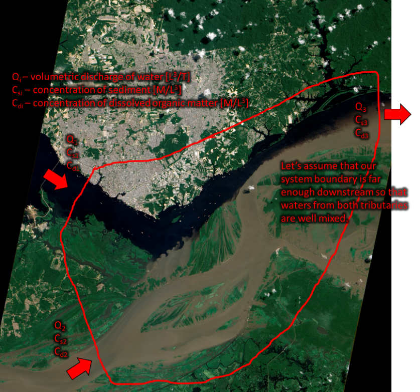
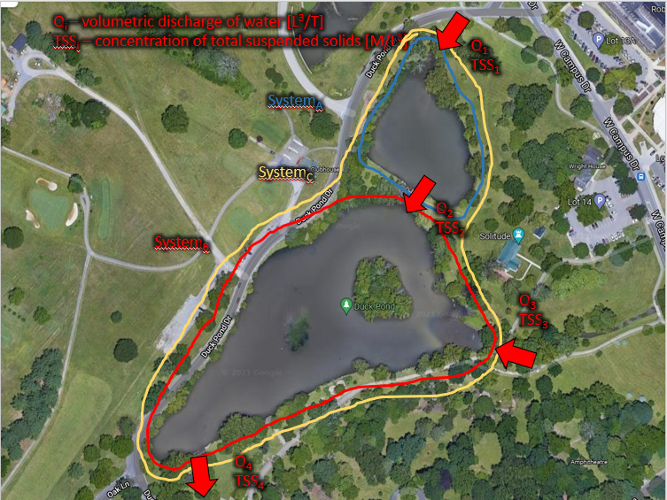

<script type="text/x-mathjax-config">
MathJax.Hub.Config({
  TeX: { 
      equationNumbers: { 
            autoNumber: "all",
            formatNumber: function (n) {return '9.'+n}
      } 
  }
});
</script>

```{r setup, include=FALSE}
knitr::opts_chunk$set(echo = FALSE, message = FALSE, warning = FALSE)


library(learnr)
library(sortable)
library(learnrhash)
#library(interactiveBSE)
#source("../custom_learnr.R")


#### Notes ####
#
#
```

# Objective: 

To evaluate mixing at a confluence of the Amazon River and mass fluxes in/out of the Duck Pond on campus.

{max-width="100%" width="100%"} 

The Encontro das Aguas in Brazil, or the "Meeting of the Waters," is where the Rio Negro and Rio Solimões join to form the Amazon River (Figure 1). The Rio Negro drains the Colombian hills and interior jungles. Runoff from this landscape is low in sediment and high in dissolved organic matter from decaying leaf and plant matter. This dissolved organic material, gives the Rio Negro its black color, like a black tea. The Rio Solimões drains the Andes Mountains and carries large sediment loads. East of Manaus, Brazil, these rivers meet to form the Amazon River. This meeting of two rivers to form one is called a confluence. At the confluence, the waters and materials carried by those waters mix. Depending on the turbulent mixing in the downstream river, it can take several to tens of kilometers until the waters from the two tributaries are well mixed.

Downstream of the "Meeting of the Waters" the Amazon River flows freely and often floods its floodplain. These floodwaters carry nutrients and sediment from the river to the floodplain where some fraction of those materials settle out and deposit on the floodplain.

Closer to home, on campus, is the familiar Duck Pond (Figure 2). Here there are actually two ponds. We can consider this as a total of three systems (A-C) with inputs at locations 1 and 3, transport from one pond to another at location 2, and output at location 4 (Figure 2). During storms, runoff from much of the Town of Blacksburg flows through underground pipes and drains directly to Duck Pond. Some sediment deposits in Duck Pond and due to high nutrient loads, there can be a high production of phytoplankton/algae within the pond. Together the inorganic solids (sediment) and organic solids (phytoplankton/algae, bits of plants/leaves, etc.) cloud the water, giving it a distinctive color, and can be measured collectively as total suspended solids (TSS). The ratio of sediment versus organic material in the TSS measurement varies in time depending on flow condition and season, among other factors.

{max-width="100%" width="100%"}

For this lab, you will use mass balances to calculate the fluxes of water, sediment, and dissolved organic mater at a confluence (Part 1; Figure 1) and at Duck Pond (Part 2; Figure 2). **REPORT ALL FINAL CALCULATED VALUES TO 3 SIGNIFICANT FIGURES.**

## Part 1:

Consider the confluence in Figure 1. There are two tributaries (labeled 1 and 2) that join to form the Amazon River (labeled 3). The streamflow $Q_{i}$, concentration of suspended sediment $C_{\text{si}}$, and concentration of dissolved organic matter $C_{\text{di}}$ for each river is as follows:

$$Q_{1} = 400,000\ \frac{\text{ft}^{3}}{s}$$

$$C_{s1} = 100\ \frac{\text{mg}}{L}$$

$$C_{d1} = 1,000\ \frac{\text{mg}}{L}$$

$$Q_{2} = 600,000\ \frac{\text{ft}^{3}}{s}$$

$$C_{s2} = \ ?\ \frac{\text{mg}}{L}$$

$$C_{d2} = 100\ \frac{\text{mg}}{L}$$

$$Q_{3} = 1,000,000\ \frac{\text{ft}^{3}}{s}$$

$$C_{s3} = 2,000\ \frac{\text{mg}}{L}$$

$$C_{d3} = \ ?\ \frac{\text{mg}}{L}$$

Assume that our system boundary is far enough downstream so that waters from both tributaries are well mixed by the outlet of the system. Calculate $C_{s2}$ and $C_{d3}$.

Dams are being planned to be constructed along the Amazon River. If the flow $Q_{2}$ and suspended sediment concentration $C_{s2}$ in tributary 2 are reduced by half, what will be the resulting values for $Q_{3}$ and $C_{s3}$, and by what percentage would the suspended sediment concentration be reduced downstream in the Amazon River (in river 3) for post-dam vs. pre-dam conditions?

```{r question-1}
question_radio("How do we obtain the mass flux in units of [M/T] from data on flow discharge in units of [L^3 /T] and concentration in units of [M/L^3 ]??", 
               answer("discharge / concentration"), 
               answer("concentration / discharge"), 
               answer("concentration × discharge", correct = TRUE), 
               answer("concentration^2 × discharge"), 
               answer("concentration + discharge"), 
               allow_retry = TRUE
               )
```


## Part 2:

Consider the Duck Pond in Figure 2. We will be estimating flow (Q) and TSS (using two different methods) at each of the four locations on the day of our lab. These will give us our inputs and output from the system as defined in each of the three ways shown in Figure 2. The only aspect of our mass balance that we are missing is the "change in storage" term, which is synonymous with a generation/production term if phytoplankton/algae is growing in the pond, giving it a more greenish color, or an accumulation/removal term if sediment is being deposited in the pond, giving it a more brownish color. The main thing you will be calculating in this lab is the "change in storage" term for each system configuration and then describing what you think is happening physically within the system with regards to your observations, measurements, and calculations.

### Measurements

The first measurement we will make at each location is of the flow discharge. However, we will do this by estimating the wetted channel area and a water velocity. Multiplying these two measurements together results in a flow discharge.

For total suspended solids, we will "measure" this in two different ways. 1) Using a transparent turbidity tube (see document in the google drive folder for this lab for more information) and 2) using a YSI ProDSS turbidity sensor (see link for manufacturer information and instrument specifications: <https://www.ysi.com/product/id-626901/prodss-turbidity-sensor>). The transparent turbidity tube is one of the simplest ways to measure turbidity. At the bottom of the tube is a Secchi disk and the depth of water above the disk when the disk is no longer visible is called the Secchi depth. The turbidity sensor we are using measures the intensity of light scattered at 90 degrees as light passes through the water. The resulting units of the measurement are in Nephelometric Turbidity Units (NTUs). Total suspended solids is measured by filtering the particulate solids (typically greater than a few micrometers) from a water sample and by knowing the weight of the filtered solids from a known water volume of the sample, you can directly measure TSS in units of mg/L, for instance. These represent three different measures of the amount of "stuff" in the water column in different units of Secchi depth, NTUs, and TSS (mg/L). None of these values have a predefined exact equation relating one value to another because there are a lot of factors that affect what each instrument/methods sees and measures. Therefore, to obtain TSS from our measurements, we have to rely on an empirically developed relationship specific to our site. Data has already been collected out at StreamLab in the reach of Stroubles Creek behind the Fox Ridge apartment complex to help us do just that (Table 1).

*Table 1. Corresponding turbidity (NTU) and TSS (mg/L) measurements.*

  Turbidity, NTU   Total Suspended Solids (TSS), (mg/L)
  ---------------- --------------------------------------
  270.7            610.5
  119.4            271.5
  50.3             129.5
  40.5             66.0
  35.7             56.0
  33.8             64.5
  31.5             52.0
  27.4             4.5
  4.3              25.0
  1.5              123.0
  2                31.0
  2                26.5

In summary, we will first measure the cross-sectional area and estimate the velocity in the channels in/out of Duck Pond to calculate a flow discharge. Then we will measure turbidity using the turbidity tube (measurement of Secchi depth) and the turbidity sensor (measurement in NTUs).

```{r question-2}
question_radio("How many different ways are we measuring turbidity in the field?", 
               answer(0), 
               answer(1), 
               answer(2, correct = TRUE), 
               answer(3), 
               answer(4), 
               allow_retry = TRUE)
```


## Data Analysis (read and follow these paragraphs carefully!)

To do the mass balance analysis, we need to calculate a flow discharge in units of [L^3^/T] and TSS in units of [M/L^3^]. For your measurements of Secchi depth and turbidity in NTU, plot these data together (without any connecting lines) as an X-Y scatter plot and fit a linear curve to the data. Report the best-fit equation and R^2^ value of the fit. Discuss the quality of fit, whether it was a good or bad fit, and reasons why it was good or bad based on field observations and measurements. That is, how well do our two measurements of turbidity compare with each other?

Next, use the data in Table 1 to develop an empirical equation relating turbidity in NTU to TSS in mg/L. Do this by plotting the data as an X-Y scatter plot with turbidity on the x-axis and TSS on the y-axis. Select a linear curve fit and display and report the best-fit equation and R^2^ value of the fit. Using this equation, convert your turbidity values of NTU measured in the field to TSS values in mg/L. These resulting TSS values are what you will use for your mass balance analysis.

### Mass Balance Analysis

Write the mass balance equations for water and TSS for systems A-C for Duck Pond (Figure 2). Calculate the "change in storage" term for water and TSS for each system. Compare and discuss the resulting values and reasons why you think the values were calculated as such considering the field conditions and measurement uncertainty.

Also, use your mass balance equations and the measurements provided below, during the rising limb of a high flow condition, to calculate the "change in storage" term for water and TSS for system C only:

$$Q_{1} = 20\ \frac{\text{ft}^{3}}{s}$$

$$\text{TSS}_{1} = 300\ \frac{\text{mg}}{L}$$

$$Q_{3} = 30\ \frac{\text{ft}^{3}}{s}$$

$$\text{TSS}_{3} = 250\ \frac{\text{mg}}{L}$$

$$Q_{4} = 40\ \frac{\text{ft}^{3}}{s}$$

$$\text{TSS}_{4} = 100\ \frac{\text{mg}}{L}$$

Discuss the resulting values of the storage terms and what they mean in terms of water/TSS accumulation/generation within Duck Pond. What is happening to/in Duck Pond when the storage term has these values/signs (+/-)?

## Discussion Questions

In addition to the questions posed above, please answer the following questions:

1\) At which measurement location(s) do you think your flow discharge measurements were most/least accurate and why? For those locations deemed least accurate, how could you improve the accuracy of your measurement?

2\) What do you think was mostly making up the particulates in your TSS measurements? That is, inorganic sediment, phytoplankton/algae, bits of leaves? How do you think this would change during high flow versus low flow conditions?

3\) How does the "change in storage" terms compare if you treat systems A and B in series (add the storage terms) versus treating the whole system together (as system C)? Do you get the same answer? Why or why not?

4\) The timescale of these measurements means that we are essentially looking at a snapshot in time of the system. Is this "instantaneous" measurement of the system the most useful, particularly given the flow conditions during our field sampling? Why or why not and for what purpose does our measurements serve? Would it be better to have measurements that integrate over a storm hydrograph or a year? And what would we learn, or what questions could we answer, if we had these longer-term timeseries measurements?

Include all system diagrams, mass balance equations, plots, curve fit equations, raw and calculated data tables, equations, and example calculations in your lab report.

```{r question-3}
question_radio("How many different plots of data should you include in your lab report?", 
               answer(0), 
               answer(1), 
               answer(2, correct = TRUE), 
               answer(3), 
               answer(4), 
               allow_retry = TRUE)

```

## Submit

```{r context="server"}
learnrhash::encoder_logic()
```

```{r encode, echo=FALSE}
learnrhash::encoder_ui(ui_before = default_ui(url = "https://canvas.vt.edu/courses/135076/quizzes/326857"))
```

