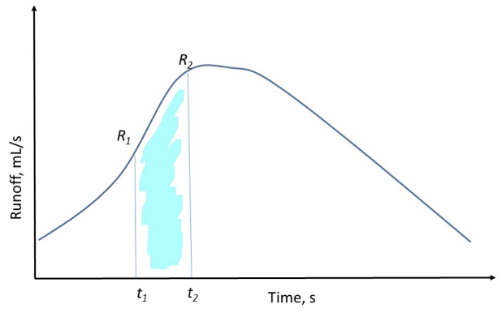

<script type="text/x-mathjax-config">
MathJax.Hub.Config({
  TeX: { 
      equationNumbers: { 
            autoNumber: "all",
            formatNumber: function (n) {return '9.'+n}
      } 
  }
});
</script>

```{r setup, include=FALSE}
knitr::opts_chunk$set(echo = FALSE, message = FALSE, warning = FALSE)


library(learnr)
library(sortable)
library(learnrhash)
#library(interactiveBSE)
#source("../custom_learnr.R")
source("custom_learnr.R")

#### Notes ####
#
#
```


**Objective:** To evaluate impact of different surface cover conditions on infiltration and runoff characteristics.

### Introduction:

Soil boxes representing different cover types will demonstrate how soil surface conditions affect infiltration and runoff timing, rate, and volume, as well as sediment loss. Four soil boxes have been set up with different ground cover types: compacted soil, tilled bare soil with landscaping mulch, tilled bare soil with straw cover, and grassed sod (Fig 1).

{max-width="100%" width="100%"}

*Figure* *1. Rainfall simulator plots*

While the rainfall simulator is running, you should observe changes to the soil surface, the depth of water infiltration over time, and soil splash against the white plot dividers. Once surface runoff starts, you will measure the runoff rate every five minutes to develop a runoff hydrograph.

```{r watershed}
question_radio(text = "What is our watershed?", 
               answer("There is no watershed."),
               answer("All of the plot boxes combined."),
               answer("A single plot area; 4 watersheds are shown in figure 1.", correct = TRUE), 
               answer("The area surrounding the plot boxes."), 
               answer("I don't know."), 
               allow_retry = TRUE)
```


### Apparatus: 

A rainfall simulator has been built to demonstrate the effects of rainfall on various surface conditions. The instructor will control the power and flowrate of the system while the students collect qualitative and quantitative data. No model, company, or accuracy are necessary to report in this lab.

### Methods:

1.  Measure plot area.

2.  Place rain gauge under the rainfall simulator.

3.  Label a beaker with your group number and the first time step (e.g., Time 1)

4.  Turn the simulator on and record the time rainfall started.

5.  Watch the boxes during the rainfall event, noting the depth of infiltration into the soil box.

6.  Record the time runoff is observed from the white plastic collectors.

7.  Immediately begin collecting 250 mL of sample in a beaker or collect sample for 5 minutes, whichever comes first. Be sure to either note the time required to collect 250 mL in the beaker, or note the volume if collection ended at 5 minutes.

8.  Place the beaker back into your group's collection of beakers in the order of when samples were taken and label an unused beaker with your group number and next time step.

9.  Collect a runoff sample every five minutes as long as runoff is occurring, recording how long it takes to fill each bottle.

10. When the rainfall simulator is turned off, immediately take another sample. Either fill to 250 mL or collect for 5 minutes, whichever comes first. Be sure to note the volume if collection ended at 5 minutes.

11. Once rainfall and runoff have ended, measure and record the depth of water in the rain gauge. Calculate the average precipitation rate in mm/hr (Note: you will need to know the area of the top of the rain gauge for this calculation).

12. Swirl all of the beakers with samples from your soil plot, line them up in order of when they were collected, and take a picture. Take a picture of other groups' beakers as well.

13. Note any changes to the soil surface or any soil splash on the white plot dividers. Take a picture of the soil splash and soil surface.

14. Note the number and color of runoff samples from the other plots.

15. Collect runoff data from other plots.

```{r scales}
question_checkbox("What are the important spatial scales that you need to measure? (multiple choice, can click multiple answers)", 
                  answer("Surface area (length and width) of each plot.", correct = TRUE), 
                  answer("Height of the plot above the ground."), 
                  answer("Area of the rain gauge opening via the diameter.", correct = TRUE), 
                  answer("Depth of water accumulated on the surface of the plot at different points in time."), 
                  answer("None."), 
                  allow_retry = TRUE)
```


### Calculations:

As part of your report, you need to determine the total volume of precipitation (over your plot), infiltration, and runoff. You can assume precipitation is constant, and that infiltration (I) is the difference between the rainfall (P) and runoff volume (R):

\begin{equation}
  I = P - R
  \tag{Eq. 1}
\end{equation}

To determine runoff volume for your plot, you need to integrate over the runoff curve. You can do this very simply by using the "Trap" Rule from Calculus.

{max-width="100%" width="100%"}

*Figure* *2. Example hydrograph*

The total volume of runoff between times 1 and 2 would be:

\begin{equation}
  V_{1,2} = \frac{1}{2}\left(R_1 + R_2 \right)\left(t_2 - t_1\right)
  \tag{Eq. 2}
\end{equation}

The total volume would be the sum of all the "trapezoids" that comprise your measurements.

### Data Analysis:

1.  Create an X-Y line graph showing the volumetric discharge (in units of **cm^3^/s**) over time for **ALL** soil plots (you should have 3 lines for the 3 soil plots); this is called a *[hydrograph]{.ul}* (e.g. Figure 2).

2.  Compute the total volume (as an equivalent depth) of precipitation, infiltration, and runoff (all in **cm**) for **ALL** plots (See "Calculations" and especially Eq. 1 and 2).

3.  Compute the percentage of the runoff depth to the precipitation depth for **ALL** plots. This is called the runoff ratio and describes the percent of rainfall that ends up as runoff.

NOTE: Remember that all tables and graphs must be numbered and include complete captions, and the raw data should be included with the report.

```{r analysis}
quiz(caption = "", 
question_radio("If 106 mL of water accumulate in the rain gauge and the diameter of the rain gauge opening is 6.7 cm, what is the depth of precipitation?",
         answer("35.3 cm"), 
         answer("6.7 cm"), 
         answer("3.0 cm", correct = TRUE), 
         answer("1 cm"), 
         answer("I don't know."), 
         allow_retry = TRUE),
question_radio("If a constant 2.5 cm^3 /s of runoff occurs over a period of 5 mins what is the total runoff volume?",
         answer("1000 cm^3"), 
         answer("750 cm^3", correct = TRUE), 
         answer("12.5 cm^3"), 
         answer("2.5 cm^3"), 
         answer("I don't know."), 
         allow_retry = TRUE),
question_radio("If 4 cm of rainfall and 1 cm of runoff occurred, what is the runoff ratio?",
         answer("4"), 
         answer("2"), 
         answer("1"), 
         answer("0.5"), 
         answer("0.25", correct = TRUE), 
         answer("I don't know."), 
         allow_retry = TRUE))
```


### Discussion Questions:

1.  Which soil box produced runoff first?

2.  Which soil box produced runoff last?

3.  What is the reason for this difference in runoff timing?

4.  Which box produced the most/least runoff? What is the reason for this difference?

5.  Visually assess the water quality of the runoff from each set of soil box samples. In particular look at the rain splash on the white dividers between soil plots.

    a.  Does one look "dirtier" than another?

    b.  Which one looks "cleaner" than the others?
    
## Submit

```{r context="server"}
learnrhash::encoder_logic()
```

```{r encode, echo=FALSE}
learnrhash::encoder_ui(ui_before = default_ui(url = "https://canvas.vt.edu/courses/135076/quizzes/322575"))
```
