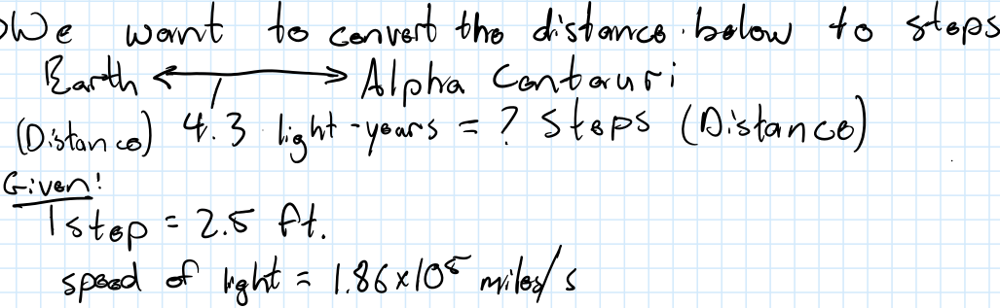

```{r setup, include=FALSE}
knitr::opts_chunk$set(echo = FALSE, message = FALSE, warning = FALSE)


library(learnr)
library(sortable)
library(learnrhash)
#library(interactiveBSE)
#source("../custom_learnr.R")
source("custom_learnr.R")

#### Notes ####
# This takes about 120 min, typically breaking for 5-10 min before "Calculations"
# Some of this is maybe too basic, could be completed outside of class, or with an entrance quiz eliminated.
# The main points to hit are unit conversions, calculation algorithm and the example 
```

## Introduction

This module will introduce the basics of engineering calculations and tools of the trade. As engineers we must be well-versed in **measurements** of all kinds and conversions between them. This requires us to have mastered **units** and conversions between them. We also need to uphold high standards in the way we communicate our calculations. Whether you are sharing your calculations with your teammate, your TA, or your boss, if they cannot understand the logic of your calculations, they will not be able to trust your solution. We will introduce a general procedure, or algorithm, for setting up, solving, and checking your engineering calculations to help communicate your solutions and designs effectively.

At the end of this module you should be able to:

- Define units and measurements and describe why the are important to engineers  
- Understand and robustly perform unit conversions  
- Use and interpret scientific notation and significant figures  
- Outline and apply the Engineering Calculation Algorithm  

You will practice the skills we introduce here through every class you take in biological systems engineering. It is always a good idea to revisit this section, particularly the algorithm for engineering calculations, regularly throughout your career. 

## Tools of the trade

### Scientific Notation

In engineering biological systems we deal with both extremely large systems like watersheds and extremely small systems like single cells. To express quantities across such wide scales and convert between them we will often make use of scientific notation. In scientific notation we will express the value of the measurement as two digits between 0.1 and 10 and then express the "order of magnitude" of the measurement as a power of 10, for example:  
$$420,000 = 4.2 \times 10^5 = 0.42 \times 10^6$$  
$$0.00013 = 1.3 \times 10^{-4} = 0.13 \times 10^{-5}$$  
The power of ten and value can easily be converted by moving the decimal left or right and adjusting the exponent plus or minus one, respectively. This can allow the powers of ten in a calculation to be easily added and subtracted, in what is known as an "order of magnitude estimation" or "back of the envelop" calculation. 

### Significant Figures

Scientific notation also allows us to easily express the precision in our measurements, and values calculated from them, using significant figures. *The significant figures of a measurement are the number digits that we are confident in our measurement/calculation of. No measurement or calculation should be considered exact!* We always need to consider how confident we are in our numbers. Significant figures allows us to present the level of uncertainty in the way we write numbers. 

The following are rules for finding the number of significant figures in a measurement.

- For measurements without a decimal point, the significant figures are the digits between the first and last nonzero digits  
  - **23**00 has 2 significant figures, in scientific notation $2.3 \times 10^4$  
  - **2303** has 4 significant figures or $2.303 \times 10^4$  
- For measurements with a decimal point but no digits to the right of the decimal the significant figures are the digits to the left of the decimal  
  - **12**,**000**. has 5 significant figures, or $1.2000 \times 10^5$  
  - **12**. has 2 significant figures with or without the decimal  
- For measurements with a decimal and digits to the right of the decimal, the significant figures are the digits between the first nonzero digit and the last digit on the right  
  - 0.0000**67** has 2 significant figures, or $6.7 \times 10^{-5}$  
  - **1.200** has 4 significant figures  
  
Scientific notation allows us to *usually* just count the digits in the value to find the number of significant figures (make sure there is not a zero to the left of the decimal).


```{r sig-figs, echo=FALSE}
quiz(caption = "How many significant figures are in the following measurements",
  question_numeric(text = "$2000 \\text{ kg}$", 
                   answer(1, correct = TRUE)),
  question_numeric(text = "$2000. \\text{ kg}$", 
                   answer(4, correct = TRUE)),
  question_numeric(text = "$2000.0 \\text{ kg}$", 
                   answer(5, correct = TRUE)),
  question_numeric(text = "$0.002 \\text{ kg}$", 
                   answer(1, correct = TRUE)),
  question_numeric(text = "$0.0020 \\text{ kg}$", 
                   answer(2, correct = TRUE))
)
```


#### How do we carry significant figures through our calculations?

- When multiplying or dividing quantities round the result to the lowest number of significant figures of the quantities. **Do not count the sig figs in conversion factors, only the given quantities!** You can assume conversion factors are known with infinite precision.  

- When adding or subtracting quantities we need to pay attention to the last (rightmost) significant figure in the quantities and keep however many significant figures in the final answer as are necessary to maintain the least number of significant figures in the initial quantities. For example, if we are adding 2 meters to 50 kilometers, our result is simply 50 kilometers. 50 kilometers has only 1 significant figure, indicating that we do not know precisely that it is 50.0 kilometers but somewhere between 45 and 54 kilometers, so adding 2 meters to this imprecise measurement is silly.  

**Significant figures can be a big deal when you are predicting the amount of water that will be available for a city or the amount of a vaccine that can be produced, pay attention to them.** As engineers we are often making predictions about a solution we are designing. These predictions are only as good as the data/measurements we use to make them. Using appropriate significant figures in our measurements and calculations is one way we can express the uncertainty in our predictions. 

## Unit conversions

Oftentimes as engineers we are putting together parts from different manufacturers and data from different sources in order design solutions. Inevitably these sources will not use the same units and we will need to convert them to equivalent units. Also within our calculations, we need to accurately convert units in order to solve for derived quantities and determine their units. Some derived quantities critical to engineering analysis are dimensionless and we need to ensure that we have appropriately canceled all units in their calculation 

In performing these calculations we must follow these rules: 

- *The numerical values of two quantities may be added or subtracted only if their units are the same*  
- *The numerical values and their units are combined by multiplication or division*  
- *Only unitless values may be used within mathematical functions such as $\sin$, $\log$, or as exponents.*  

### How do we convert units?

Using conversion factors. Conversion factors are equivalencies between different units, for example 10 mm = 1 cm. To convert from one unit to another we multiply by this conversion factor, because it is an equivalency, it is just like multiplying by 1. 

Conversion factors for multiple units are simple, 1 mm = 10^-3^ m, 12 in. = 1 ft. Conversion factors between base units can be found in tables in many books as well as on [the internet](https://www.google.com/search?q=unit+conversions). 

*Always write out unit conversions fully and check that units cancel out to result in the correct final units!* This practice will result in accurate calculations. We recommend using the "train track" method for unit conversions. This method is just a simplified notation that makes carrying along units in your calculations easier. For example we could convert 36 mg to grams 

$$
\left(36 \text{ mg} \right) \times \left(\frac{1 \text{ g}}{1000 \text{ mg}} \right) 
= 0.036 \text{ g}
$$
Or 

$$
    \begin{array}{c|c}
     36 \text{ mg} & 1 \text{ g} \\ \hline
                   & 1000 \text{ mg}  
    \end{array} = 0.036 \text{ g}
$$ 

This looks much cleaner than multiplication signs and lines up nicely on ruled paper or engineering paper. 

Sometimes it is convenient to use multiple simple conversion factors, as in converting times. What if we wanted to convert 1 m^2^/s to m^2^/h?

$$
    \begin{array}{c|c|c}
     1\text{ m}^2 & 60 \text{ s}  & 60 \text{ min} \\ \hline
      \text{s}    & \text{min}    & \text{hr}
    \end{array} = 3600 \text{ m}^2/\text{hr}
$$ 

### Conversion factors are self-correcting

```{r conv-error, echo=FALSE}
quiz(
  question(
    sprintf(
      "What units would result if we accidentally flipped the final conversion factor, multiplying by [1 hr/60 min] instead of [60 min/1 hr], in the above calculation?"
    ),
    answer(
      sprintf("$\\text{m}^2 \\cdot \\text{hr}/\\text{min}^2$"),
      correct = TRUE
    ),
    answer(sprintf(
      "$\\text{m} \\cdot \\text{hr}/\\text{min}^2$"
    )),
    answer(sprintf("$\\text{m}^2 \\cdot \\text{hr}$")),
    answer(sprintf("$\\text{m}^2 \\cdot \\text{hr} \\cdot \\text{min}$")),
    random_answer_order = TRUE,
    allow_retry = TRUE
  ),
  
  question_checkbox(
    "How would you know this conversion was incorrect?",
    answer("There are multiple time units left", correct = TRUE),
    answer("I just know"),
    answer("The units don't cancel out", correct = TRUE),
    answer("You don't get the correct final units", correct = TRUE),
    random_answer_order = TRUE,
    allow_retry = TRUE
  )
)

```


An equation with units written in it like those above are called a **dimensional equations**, because we are also determining the dimensions of our answer in addition to the numerical value.

### Example 

Convert an acceleration of $1\text{ cm/s}^2$ to $\text{km}/\text{yr}^2$.

```{r unit-conv-ex, echo=FALSE}
quiz(caption = "",
  ### 1
  question_text_block(
    sprintf(
      "Describe how would you convert an acceleration of $\\mathbf{1\\text{ cm/s}^2}$ to the equivalent measure in $\\mathbf{\\text{km}/\\text{yr}^2?}$"
    ),
    message = sprintf(
      "You need to use multiple conversion factors to cancel each of the units. So $100 \\text{ cm} = 1 \\text{ m}$ and $1000 \\text{ m} = 1 \\text{ km}$ for the length units and $60 \\text{ s} = 1 \\text{ min}$, $60 \\text{ min} =  1 \\text{ hr}$, $1 \\text{ day} = 24 \\text{ hr}$, and $365 \\text{ days} = 1 \\text{ yr}$."
    ),
    answer("", correct = TRUE),
    allow_retry = TRUE,
    correct = paste(learnr::random_praise(), 
                    "Here's our answer:"),
    try_again = "Here's our answer:"
  ),
  #### 3
  question_text_block(
    "How do you deal with the time being squared?",
    message = sprintf(
      "Since time units are squared you simply need to square all of the conversion factors such that the units cancel and magnitudes are correctly scaled."
    ),
    answer("", correct = TRUE),
    allow_retry = TRUE,
    correct = paste(learnr::random_praise(), 
                    "Here's our answer:"),
    try_again = "Here's our answer:"
  )
)
```

### Solution

**Note that you may need to scroll to the right to see the full calculation.**

$$ 
    \begin{array}{c|c|c}
     1\text{ cm} & 60^2 \text{ s}^2  & 60^2 \text{ min}^2 &  24^2 \text{ hr}^2 & 365^2 \text{ days}^2 & 1 \text{ m} &
      1 \text{ km}\\ \hline
      \text{s}^2    & \text{min}^2    & \text{hr}^2       & 1 \text{ day}^2 & 1 \text{ yr}^2    & 100 \text{ cm} &
      1000 \text{ m}
    \end{array} = 1\times10^{10} \text{ km}/\text{year}^2
$$

To make sure that you don't miss any exponents in your calculation we also recommend writing this out like this:

$$ 
    \begin{array}{c|c|c}
     1\text{ cm} & 60 \text{ s} & 60 \text{ s} & 60 \text{ min} & 60 \text{ min} &  24 \text{ hr} & 24 \text{ hr} & 365 \text{ days} & 365 \text{ days} & 1 \text{ m} &
      1 \text{ km}\\ \hline
      \text{s}^2    & \text{min} &  \text{min}  & \text{hr} & \text{hr} &  \text{ day} & \text{ day} &  \text{ yr} & \text{ yr}    & 100 \text{ cm} &
      1000 \text{ m}
    \end{array} = 1\times10^{10} \text{ km}/\text{yr}^2
$$

Finally we can plug this into our calculator (R is used here to also adjust sig figs).

```{r, echo=TRUE}
signif(60^2*60^2*24^2*365^2/100/1000, 1)
```

### Your turn

```{r units-numeric-answer, echo=FALSE}
  #### 2
  question_numeric(
    sprintf(
      "What is $\\mathbf{60.0\\text{ m}^3/\\text{yr}}$ in $\\mathbf{\\text{ gallons/day}}$"
    ),
    answer(43.4, correct = TRUE),
    answer(43, correct = FALSE, 
           message = "Double check your sig figs"), 
    answer(43.42, correct = FALSE, 
           message = "Double check your sig figs"),     
    answer(43.417, correct = FALSE, 
           message = "Double check your sig figs"),
    allow_retry = TRUE, 
    try_again = "The answer should be close to 43."
  )
```

Conversions between compound units require us to use multiple conversion factors between the base units to cancel out the original units and end with the desired new units, similar to our time conversion. 

## Calculations

### The Engineering Calculation Algorithm

In performing engineering calculations, it is generally best to proceed as follows:

1. Draw a diagram of the system of interest and label the diagram with everything you know about the problem. What are the boundaries of the system? What is going into the system? What is coming out of the system? What quantities are given? What quantities are unknown? What units are given and asked for?
2. Derive and write down the equations describing the system? These will typically be derived from material and energy balances (more on these later). 
3. Double check that you have enough information to solve the problem with a degree of freedom analysis.
4. Plan a strategy for solving the problem. Is it a simple single balance that must be solved? Do you need to simultaneously solve a system of equations? Is there an analytical solution to the equations?
5. Solve the equations **symbolically** for the desired quantity, if possible or use equation solving software. Generally, this will prevent errors in your calculations by simplifying them (canceling single symbols is easier than canceling compound units). 
6. Write a dimensional equation for your solution, plugging in values and units of given quantities, and apply any necessary conversion factors to calculate the desired quantity in the desired units.
7. Double check that your answer is feasible. How do you know your answer is right? You can plug your answer back into your balance equation and calculate a known quantity, estimate the "order of magnitude" of your answer, and/or just ask yourself "does this number make physical sense"?

**Throughout this process it is enormously useful to write down your reasoning for what you are doing. What is your next goal? What is your strategy for solving this system of equations? Why are you assuming this term in your balance is negligible?** This helps you and others understand what you are doing, for example if your colleague or boss is reviewing your calculations. Leslie Lamport, a famous computer scientist has a great quote along these lines, "If you are thinking without writing, you only think you're thinking." Writing out the logic of you solution will help you think through it critically, improving your learning and reducing your chances of making mistakes. Writing out your reasoning can also help you get partial credit.


```{r sort-algorithm, echo=FALSE}
sortable::question_rank(
  "Sort the steps in the engineering calculation algorithm into the correct order",
  learnr::answer(c("Diagram", "Balances",
  "Degrees of freedom (DoF)", 
  "Strategy", 
 "Solve", 
 "Calculate", 
 "Check"), 
 correct = TRUE
  ), 
  allow_retry = TRUE
)

```


### Putting it all together

Using a single dimensional equation, estimate the number of steps it would take for you to walk from Earth to Alpha Centauri, a distance of 4.3 light years, assuming your steps are 2.5 ft on average. The speed of light is $1.86 \times 10^5$ miles/s.  

```{r ac-getting-started}
question_text_block("How are we going to start this? What do we want to convert to what? What is it that we are given? Draw out the problem to help you understand it.", 
                    message = 'To start we should review our engineering calculation algorithm. Step 1 is: Draw a diagram of the system of interest and label the diagram with everything you know about the problem. What quantities are given? What quantities are unknown? What units are given and asked for? 
      So to start we want to convert a distance to a distance, light-years to steps. You could draw out a simple diagram like the following, and label it with the given quantities.
      
      ',
    answer("", correct = TRUE),
    allow_retry = TRUE,
    correct = paste(learnr::random_praise(), 
                    "Here's our answer:"),
    try_again = "Here's our answer:"
)

```


We will cover more about Steps 2 and 3 of our calculation algorithm in the next sections of the course, but for unit conversions these are trivial. We don't need a formula for a conversion, just the conversion factors to cancel out the current units until we get to the desired units.

So on to Step 4: Plan a strategy which we just did. The critical thing to know here is that light-years are a unit of distance.

Step 5: Now we can solve the problem. In this case this means writing out our dimensional equation. 

Write out your dimensional equation now.

Step 6: Calculate. Plug in the numbers into your calculator. Don't forget significant figures. How many sig figs are in the given values?


```{r alg-num-ans, echo=FALSE}
  #### 2
  question_numeric(
    sprintf(
      "So how many steps would it take for you to walk from Earth to Alpha Centauri?"
    ),
    answer(signif(4.3 * 365 * 24 * 3600 * 1.86E5 * 5280 / 2.5, 2), correct = TRUE),
    answer(signif(4.3 * 365 * 24 * 3600 * 1.86E5 * 5280 / 2.5, 3), 
           correct = FALSE, 
           message = "Double check your sig figs"), 
    answer(signif(4.3 * 365 * 24 * 3600 * 1.86E5 * 5280 / 2.5, 4),
           correct = FALSE, 
           message = "Double check your sig figs"),     
    answer(signif(4.3 * 365 * 24 * 3600 * 1.86E5 * 5280 / 2.5, 1), 
       correct = FALSE, 
       message = "Double check your sig figs"), 
    answer(signif(4.3 * 365 * 24 * 60 * 1.86E5 * 5280 / 2.5, 1), 
           correct = FALSE, 
           message = "Double check your sig figs"), 
    allow_retry = TRUE, 
    try_again = "The correct order of magnitude is 10^16^. Double check that all of your units cancel out correctly. Sometimes it helps to start with a fresh piece of paper. Light-years are tricky, it helps to write it out $d = vt$, distance is velocity times time.", 
    post_message = "$$
\\begin{array}{c|c|c}
     4.3\\text{ light-years} & 365 \\text{ days}  & 24 \\text{ hr} & 3600\\text{ s} & 
     1.86 \\times 10^5 \\text{ miles}  & 5280\\text{ ft} & \\text{ step}\\\\ \\hline
                            & \\text{year}        & \\text{day} & \\text{hour} & 
     \\text{s}                         & \\text{mile} & 2.5 \\text{ ft}
\\end{array} = 5.3 \\times 10^{16} \\text{ steps}
$$
Also, note how simple it is to just multiply by numbers on the top of the dimensional equation and divide by numbers on the bottom when typing this into your calculator and don't forget our given values are all with 2 sig figs so our answer should have 2 sig figs.
"
  )
```

Now onto step 7, you won't always get automated confirmation that you have the correct answer. On the job hopefully you will have good colleagues to double check your work, but how can you double check that your answer is feasible? 

```{r double-check}
question_text_block("How could you double check your answer?", 
                    message = 'You could probably guess that it is going to be an extraordinarily large number of steps. All of your units cancel out appropriately, so that is good. You could google the conversion from light-years to miles and double check part of your calculation. For example 1 light year is how many miles? Here is our handwritten solution:
      
      ',
    answer("", correct = TRUE),
    allow_retry = TRUE,
    correct = paste(learnr::random_praise(), 
                    "Here's our answer:"),
    try_again = "Here's our answer:"
)
```

## Flow Diagrams

Making a clear and complete flow diagram makes solving a difficult engineering problem much easier. This diagram should give you an accurate picture of what is known and unknown in the system/process and how it is operating. It also defines any assumptions you are making about a system/process.

A **system** or a **process** can be nearly anything in biological systems engineering, a single molecule, a single cell, a test tube or petri dish full of cells or molecules, a whole animal or plant, a short segment of a stream, a fermentor full of thousands of liters of molecules and cells, a small retention pond,a whole field or farm, a confluence of rivers, a whole watershed, or the entire Earth and its atmosphere. In this test we will use **system** to describe these physical items, to which we apply engineering principles. We will use **process** to describe systems in which some physical, chemical, or biological reaction is happening, for example, settling of sediments, detoxification of contaminants, or growth of cells. 

In drawing flow diagrams we will typically begin with a drawing a box representing our system of interest (or some other pictorial representation). 

Our goal as engineers is to describe these systems and processes mathematically


1. Draw a diagram of the system of interest and label the diagram with everything you know about the problem.
    + Fully label every input and output stream with known variables.
    + Label unknown variables with appropriate symbols. 
    + Minimize unknown variables. Are there any unknowns that you can define in terms of other unknowns. For example, if you have a 3 component mixture, you only need to define 2 as unknowns, because the third component will be remainder of that mixture. 
    + Simplify future calculations by looking over your flow diagram and deciding what units are are going to be most convenient for doing the calculations. This is called the **basis** of calculation. What final units do you need? What units are most given quantities in? Convert any quantities with odd units to the basis.

## Mixtures and composition variables


## Submit

```{r context="server"}
learnrhash::encoder_logic()
```

```{r encode, echo=FALSE}
learnrhash::encoder_ui(ui_before = default_ui(url = "https://canvas.vt.edu/courses/135076/quizzes/314176"))
```

