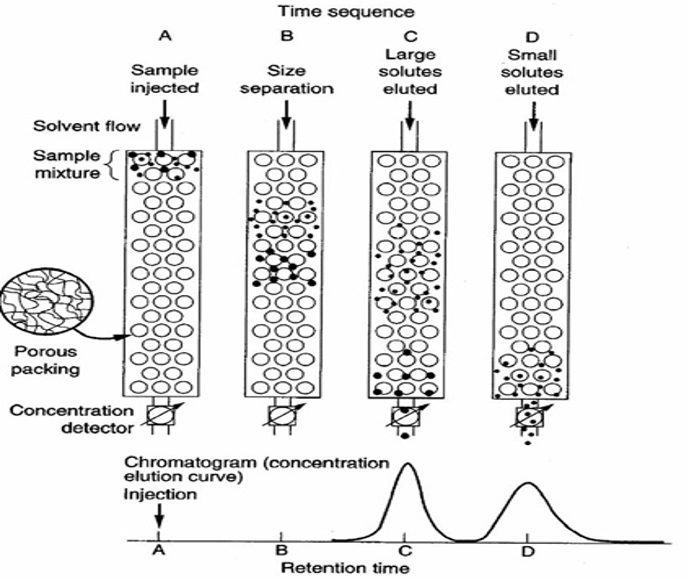

```{r setup, include=FALSE}
knitr::opts_chunk$set(echo = FALSE, message = FALSE, warning = FALSE)


library(learnr)
library(sortable)
library(learnrhash)
#library(interactiveBSE)
#source("../custom_learnr.R")
source("custom_learnr.R")

#### Notes ####
#
#
```


## Goal

The goal of this laboratory is to introduce students to the concept of size exclusion chromatography (SEC) reinforce the concept of mass conservation.

Specifically, after this lab, students will be able to do the following:

1.  Understand and explain the mechanism of SEC.  

2.  Explain what a chromatogram is, and what different peaks in a chromatogram represent.

2.  Perform an experiment that isolates the protein, BSA, from the salt, imidazole.

3.  Develop a conclusion on the efficiency of SEC using the conservation of mass.

## Introduction

Recombinant protein production for industrial, therapeutic, and diagnostic uses is a billion-dollar industry. Proteins are produced by a multitude of organisms from simple prokaryotes like *Escherichia coli* to more complex organisms like *Chinese Hamster Ovary* (CHO) cells, plants, and even animals, depending on the physical and chemical properties of each protein. A major challenge for engineers producing these proteins is how to economically purify the molecule by removing other impurities (DNA, RNA, cell debris, other proteins, etc.). To accomplish this purification, a series of steps, known as separation processes or unit operations, is implemented. The nature of the protein and impurities determines which steps should be used and in what order to implement them. These unit operations often account for 50-80% of total production costs.

Chromatography is a process for separating a target biological molecule from complex mixtures, and it is **the most commonly used** unit operation in protein purification. The operation involves the passing of a "mobile phase" (which flows) through a "stationary phase" (which does not move throughout the operation). The mobile phase is a sample or buffer, while the stationary phase is a collection of certain solid materials often with attached chemical ligands, which interact with the target molecule in a certain way. Molecules that do not interact with the stationary phase move through the column quickly, while molecules that do interact "stick" or adsorb to the stationary phase or move through the column at a much slower rate due to the interaction. Changing the nature of the mobile phase can detach or desorb the adsorbed material. If different containers are placed under a column to receive the liquid flowing out, a separation is achieved with different molecules collected in different containers. This will yield a purer solute, since some of the impurities have been removed. The nature of the interaction is what determines which type of chromatography is utilized. Some examples of chromatography types and the interactions they are based on are gel filtration/size exclusion (protein size), ion exchange (charge), and affinity (very specific interactions that the target molecule has with the resin).

The movement of proteins/solutes through a chromatography column can be tracked by measuring the absorbance of UV light (wavelength λ = 280 nm) over time as the mobile phase moves through the column. The plot of absorbance vs time is called a chromatogram. A chromatogram can be constructed automatically using advanced chromatography equipment with a built-in UV detector or manually by using a spectrophotometer to measure the absorbance of small samples collected from the column, called fractions, throughout the experiment. The absorbance of a protein depends on the specific protein chemical composition and structure and is closely related to the proteins concentration in solution.

The relationship between light absorbance and concentration of a solute in solution can be described by Beer's law:

A = ε b c (1)

where A is the absorbance at a specific wavelength (280 nm in our case); ε (epsilon) is the molar absorptivity, solute-dependent extinction coefficient, or attenuation coefficient (all synonymous, [concentration^-1^ distance^-1^]); b is the is the sample path length (the width of the cuvette, which is 1 cm for this lab); and, c is the concentration of the compound in solution, expressed in mol/L or mg/ml depending on how ε is expressed.

```{r beers-law}
question_radio("What are the units of absorbance?", 
               answer("unitless", correct = TRUE), 
               answer("concentration^-1 distance^-1", message = "Use dimensional analysis of Beer's law to find your answer"),
               answer("concentration", message = "Use dimensional analysis of Beer's law to find your answer"),
               answer("concentration^-1", message = "Use dimensional analysis of Beer's law to find your answer"),
               answer("length^-1", message = "Use dimensional analysis of Beer's law to find your answer"), 
               random_answer_order = TRUE, 
               allow_retry = TRUE)
```


Gel filtration chromatography (or size exclusion chromatography, SEC) uses differences in protein/impurity sizes to separate them. The resin (or stationary phase) has pores of a certain size. Larger molecules cannot enter the pores, while smaller ones can. This fact means that the smaller molecules leave the column later than the larger ones, since the molecules spend more time moving through the pores than the larger proteins. The term *elute* is often used to mean "leave the column". A representative chromatogram is shown in Figure 1.

{max-width="100%" width="100%"}

**Figure 1.** Gel filtration chromatography separates molecules based on size. Larger molecules (Represented by C in the chromatogram) pass through the column before the smaller (D) material.

```{r elute-general}
question_radio("Which molecules will elute first from a size exclusion/gel filtration column?", 
               answer("largest", correct = TRUE),
               answer("smallest"), 
               answer("most charged"), 
               answer("least charged"),
               answer("most sticky"),
               answer("least sticky"), 
               random_answer_order = TRUE, 
               allow_retry = TRUE
               )
```


Besides separating proteins, another common application of SEC is to separate proteins from salts (which are much smaller than proteins). This process is called desalting, a very important step in most protein purification processes. In this laboratory, you will perform a simple separation of a protein (bovine serum albumin) from a small molecule or salt (imidazole). The two materials should absorb light at UV 280 nm, and you will need to reconstruct the chromatogram and carry out a simple mass balance on the protein to determine how much you may have recovered/lost through this operation.

## Equipment 

(\* means need to provide equipment citation)

1.  One pre-packed PD-10 column\*

2.  A sample containing a mixture of the protein Bovine serum albumin (BSA) and the salt Imidazole, where the concentration of the protein is 1 mg/mL (determined by Beer's Law and Total Protein Assay) and Imidazole is 0.2 M. Properties of BSA and Imidazole are as follows:

    a.  Bovine serum albumin (BSA)\* (MW=66,382 Da, ε=0.505 cm^-1^ mg^-1^ mL)

    b.  Imidazole\* (C~3~H~4~N~2~, MW=68 Da, ε=0.697 cm^-1^ M^-1^)
    
```{r elute-specific}
question_radio("Which molecule above will elute first from a size exclusion/gel filtration column?", 
               answer("BSA", correct = TRUE),
               answer("imidazole"), 
               random_answer_order = TRUE, 
               allow_retry = TRUE
               )
```

3.  Pipettes\* and tips

4.  Deionized (D.I.) water

5.  Centrifuge tubes and rack

6.  Ring stand with clamp

7.  UV Spectrophotometer\* set at 280 nm

8.  Micro-cuvettes

9.  Beaker

## Procedure

1.  Remove the top cover and pour off the column storage solution into waste beaker.

2.  Set up column on stand with the open top up and the funnel down.

3.  Cut the sealed bottom-end of the column at the notch and let the solution (buffer) drain into the waste beaker.

4.  Equilibrate the column with D.I. Water by filling the column and allowing it to enter and flow through the packed bed.

5.  Repeat the equilibration step four times and discard flow-through.

6.  Add 2.5 ml of sample to the top of the column.

```{r total-input}
question_numeric("How much total protein are you loading in mg?", 
                 answer(2.5, correct = TRUE, 
                        message = "1 mg/mL $\\times$ 2.5 mL "),
                 allow_retry = TRUE
                 )
```


7.  Let the sample enter the packed bed completely and do not collect what is dripping out of the column.

8.  Once the excess sample has stopped dripping from the column, cap the column output.

9.  In your tube rack line up a row of 14 micro-centrifuge tubes under the column output to collect your fractions. Label each tube with the fraction number.

10. Fill column with D.I. water.

11. Uncap the column output and begin collection of samples immediately. Start the timer as soon as the first drops start coming out.

12. Collect ~0.5-mL fractions approximately every 25 seconds for the first 4 mL.

13. Make sure that one team member keeps the column full of D.I. water to keep the flow rate as constant as possible.

```{r full-column}
question_text_block("Why is it important to keep the column full?", 
                    message = 'You want to maintain a constant pressure on the top of the column in order to maintain a constant flow rate out of the bottom of the column. Also if the column dries out the particles can begin to collapse and trap the molecules you are trying to separate or prevent them from separating effectively.',
    answer("", correct = TRUE),
    allow_retry = TRUE,
    correct = paste(learnr::random_praise(), 
                    "Here's our answer:"),
    try_again = "Here's our answer:"
)
```


14. After the first 4 mL are collected, collect \~1 mL fractions about every 40-45 seconds.

15. Continue to add D.I. water until a total of 13 mL has been collected.

16. Mix each fraction by inverting the micro-centrifuge tubes and place solution into a micro-cuvette.

17. Set the blank absorbance of a cuvette containing 0.5 mL D.I. water.

18. Measure each fraction at λ= 280 nm using the spectrophotometer. Record the absorbance value.

## Data analysis

1.  Construct a chromatogram based on the UV~280nm~ measurements for each dataset (x-axis should be time or fraction number, such as 1 to 12; y-axis should be absorbance at arbitrary unit).

2.  Identify the fractions which most likely contain protein, and determine protein concentration (mol/L or mg/ml depending on how ε is expressed) in each fraction using Beer's law AND the amount of protein (mg) collected in each fraction.

```{r protein-fraction}
quiz(
question_radio("Which fractions contain the protein?", 
               answer("Fractions in the first peak in the chromatogram", 
                      correct = TRUE), 
               answer("Fractions in the second peak in the chromatogram"), 
               answer("All fractions"), 
               allow_retry = TRUE, 
               random_answer_order = TRUE),
question_radio("How much total protein is in a 0.5 mL fraction with absorbance 0.303?", 
               answer("0.3 mg", correct = TRUE), 
               answer("0.6 mg", message = "Don't forget to multiply by volume. This would be the correct concentration in mg/mL of this fraction"),
               answer("0.4 mg", message = "Make sure you are using the correct extinction coefficient"),
               answer("0.2 mg", message = "Make sure you are using the correct extinction coefficient"),
               answer("0.4 moles", message = "Make sure you are using the correct extinction coefficient"),
               answer("0.2 moles", message = "Make sure you are using the correct extinction coefficient"), 
               allow_retry = TRUE, 
               random_answer_order = TRUE
               )
)
```


3.  Carry out protein mass balance to determine the protein recovery yield from this chromatography operation using the following equation:

$$\text{Yield} = \ \%\ \text{Recovered} = \frac{\sum_{}^{}\text{total}\ \text{protein}\ in\ \text{fractions}}{\text{protein}\ \text{loaded}\ \text{into}\ \text{column}}*100$$

## Discussion Questions

Focus the Discussion section of your lab report on the following questions.

1.  Based on the chromatogram you reconstructed and your knowledge of size exclusion chromatography, when was protein vs imidazole eluted from the column? Which fractions contain protein? Discuss what factors cause this trend.

2.  How much protein was recovered in each experiment? Discuss factors that may affect protein recovery. Where might you have lost protein?

3.  What are some errors or anomalies that could have been introduced causing the differences in your groups experiment from other groups?

## Submit

```{r context="server"}
learnrhash::encoder_logic()
```

```{r encode, echo=FALSE}
learnrhash::encoder_ui(ui_before = default_ui(url = "https://canvas.vt.edu/courses/135076/quizzes/319799"))
```


